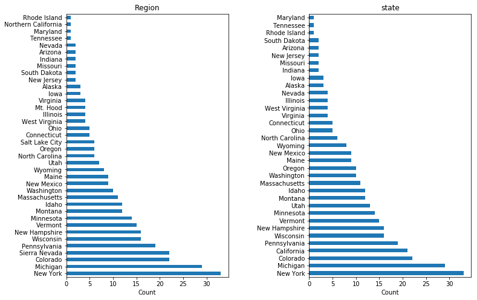
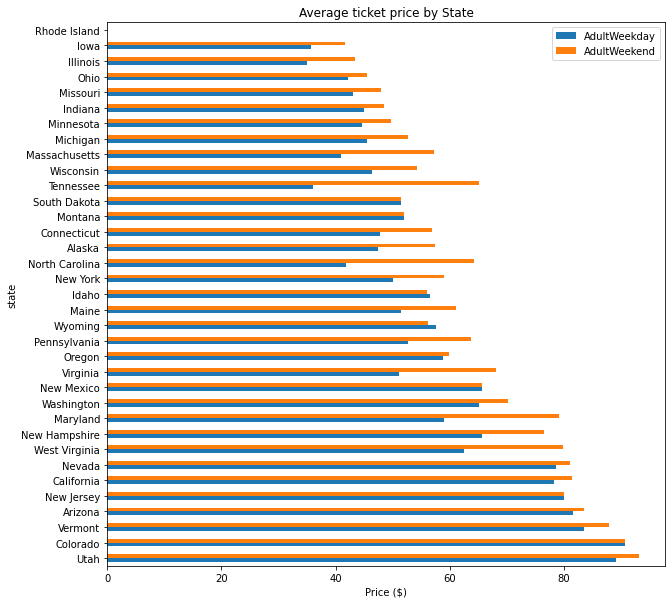
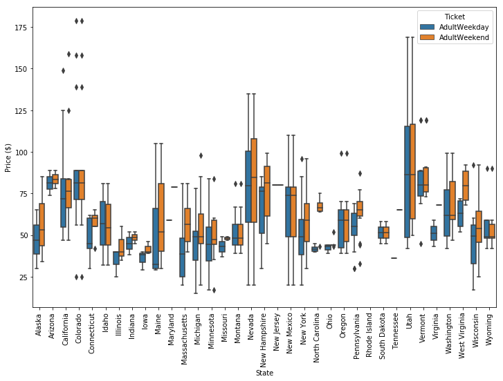
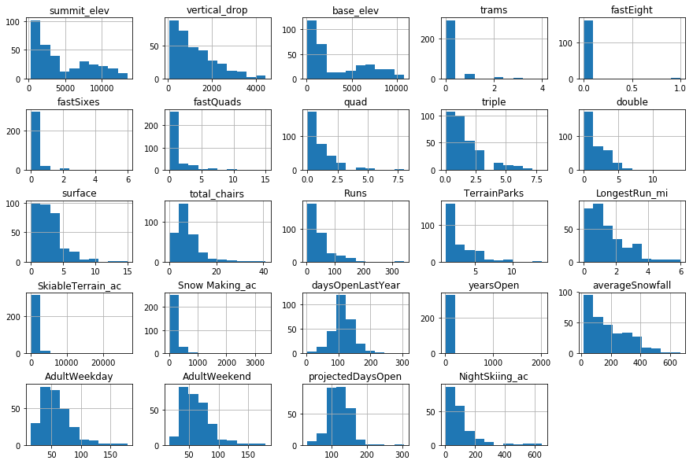
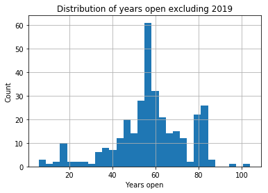
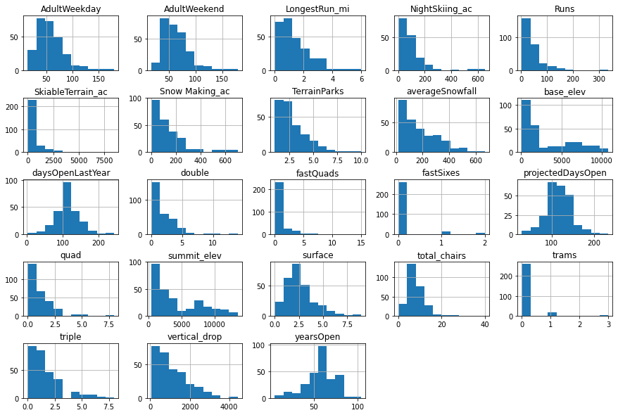
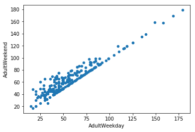

# 2 Data wrangling<a id='2_Data_wrangling'></a>

## 2.1 Contents<a id='2.1_Contents'></a>
* [2 Data wrangling](#2_Data_wrangling)
  * [2.1 Contents](#2.1_Contents)
  * [2.2 Introduction](#2.2_Introduction)
    * [2.2.1 Recap Of Data Science Problem](#2.2.1_Recap_Of_Data_Science_Problem)
    * [2.2.2 Introduction To Notebook](#2.2.2_Introduction_To_Notebook)
  * [2.3 Imports](#2.3_Imports)
  * [2.4 Objectives](#2.4_Objectives)
  * [2.5 Load The Ski Resort Data](#2.5_Load_The_Ski_Resort_Data)
  * [2.6 Explore The Data](#2.6_Explore_The_Data)
    * [2.6.1 Find Your Resort Of Interest](#2.6.1_Find_Your_Resort_Of_Interest)
    * [2.6.2 Number Of Missing Values By Column](#2.6.2_Number_Of_Missing_Values_By_Column)
    * [2.6.3 Categorical Features](#2.6.3_Categorical_Features)
      * [2.6.3.1 Unique Resort Names](#2.6.3.1_Unique_Resort_Names)
      * [2.6.3.2 Region And State](#2.6.3.2_Region_And_State)
      * [2.6.3.3 Number of distinct regions and states](#2.6.3.3_Number_of_distinct_regions_and_states)
      * [2.6.3.4 Distribution Of Resorts By Region And State](#2.6.3.4_Distribution_Of_Resorts_By_Region_And_State)
      * [2.6.3.5 Distribution Of Ticket Price By State](#2.6.3.5_Distribution_Of_Ticket_Price_By_State)
        * [2.6.3.5.1 Average weekend and weekday price by state](#2.6.3.5.1_Average_weekend_and_weekday_price_by_state)
        * [2.6.3.5.2 Distribution of weekday and weekend price by state](#2.6.3.5.2_Distribution_of_weekday_and_weekend_price_by_state)
    * [2.6.4 Numeric Features](#2.6.4_Numeric_Features)
      * [2.6.4.1 Numeric data summary](#2.6.4.1_Numeric_data_summary)
      * [2.6.4.2 Distributions Of Feature Values](#2.6.4.2_Distributions_Of_Feature_Values)
        * [2.6.4.2.1 SkiableTerrain_ac](#2.6.4.2.1_SkiableTerrain_ac)
        * [2.6.4.2.2 Snow Making_ac](#2.6.4.2.2_Snow_Making_ac)
        * [2.6.4.2.3 fastEight](#2.6.4.2.3_fastEight)
        * [2.6.4.2.4 fastSixes and Trams](#2.6.4.2.4_fastSixes_and_Trams)
  * [2.7 Derive State-wide Summary Statistics For Our Market Segment](#2.7_Derive_State-wide_Summary_Statistics_For_Our_Market_Segment)
  * [2.8 Drop Rows With No Price Data](#2.8_Drop_Rows_With_No_Price_Data)
  * [2.9 Review distributions](#2.9_Review_distributions)
  * [2.10 Population data](#2.10_Population_data)
  * [2.11 Target Feature](#2.11_Target_Feature)
    * [2.11.1 Number Of Missing Values By Row - Resort](#2.11.1_Number_Of_Missing_Values_By_Row_-_Resort)
  * [2.12 Save data](#2.12_Save_data)
  * [2.13 Summary](#2.13_Summary)


## 2.2 Introduction<a id='2.2_Introduction'></a>

This step focuses on collecting your data, organizing it, and making sure it's well defined. Paying attention to these tasks will pay off greatly later on. Some data cleaning can be done at this stage, but it's important not to be overzealous in your cleaning before you've explored the data to better understand it.

### 2.2.1 Recap Of Data Science Problem<a id='2.2.1_Recap_Of_Data_Science_Problem'></a>

The purpose of this data science project is to come up with a pricing model for ski resort tickets in our market segment. Big Mountain suspects it may not be maximizing its returns, relative to its position in the market. It also does not have a strong sense of what facilities matter most to visitors, particularly which ones they're most likely to pay more for. This project aims to build a predictive model for ticket price based on a number of facilities, or properties, boasted by resorts (*at the resorts).* 
This model will be used to provide guidance for Big Mountain's pricing and future facility investment plans.

### 2.2.2 Introduction To Notebook<a id='2.2.2_Introduction_To_Notebook'></a>

Notebooks grow organically as we explore our data. If you used paper notebooks, you could discover a mistake and cross out or revise some earlier work. Later work may give you a reason to revisit earlier work and explore it further. The great thing about Jupyter notebooks is that you can edit, add, and move cells around without needing to cross out figures or scrawl in the margin. However, this means you can lose track of your changes easily. If you worked in a regulated environment, the company may have a a policy of always dating entries and clearly crossing out any mistakes, with your initials and the date.

**Best practice here is to commit your changes using a version control system such as Git.** Try to get into the habit of adding and committing your files to the Git repository you're working in after you save them. You're are working in a Git repository, right? If you make a significant change, save the notebook and commit it to Git. In fact, if you're about to make a significant change, it's a good idea to commit before as well. Then if the change is a mess, you've got the previous version to go back to.

**Another best practice with notebooks is to try to keep them organized with helpful headings and comments.** Not only can a good structure, but associated headings help you keep track of what you've done and your current focus. Anyone reading your notebook will have a much easier time following the flow of work. Remember, that 'anyone' will most likely be you. Be kind to future you!

In this notebook, note how we try to use well structured, helpful headings that frequently are self-explanatory, and we make a brief note after any results to highlight key takeaways. This is an immense help to anyone reading your notebook and it will greatly help you when you come to summarise your findings. **Top tip: jot down key findings in a final summary at the end of the notebook as they arise. You can tidy this up later.** This is a great way to ensure important results don't get lost in the middle of your notebooks.

In this, and subsequent notebooks, there are coding tasks marked with `#Code task n#` with code to complete. The `___` will guide you to where you need to insert code.

## 2.3 Imports<a id='2.3_Imports'></a>

Placing your imports all together at the start of your notebook means you only need to consult one place to check your notebook's dependencies. By all means import something 'in situ' later on when you're experimenting, but if the imported dependency ends up being kept, you should subsequently move the import statement here with the rest.


```python
#Code task 1#
#Import pandas, matplotlib.pyplot, and seaborn in the correct lines below
import pandas as pd
import matplotlib.pyplot as plt
import matplotlib as mpl
import seaborn as sns
import os
```

## 2.4 Objectives<a id='2.4_Objectives'></a>

There are some fundamental questions to resolve in this notebook before you move on.

* Do you think you may have the data you need to tackle the desired question?
    * Have you identified the required target value?
    * Do you have potentially useful features?
* Do you have any fundamental issues with the data?

## 2.5 Load The Ski Resort Data<a id='2.5_Load_The_Ski_Resort_Data'></a>


```python
# the supplied CSV data file is the raw_data directory
ski_data = pd.read_csv('ski_resort_data.csv')
```

Good first steps in auditing the data are the info method and displaying the first few records with head.


```python
#Code task 2#
#Call the info method on ski_data to see a summary of the data
ski_data.info()
```

    <class 'pandas.core.frame.DataFrame'>
    RangeIndex: 330 entries, 0 to 329
    Data columns (total 27 columns):
    Name                 330 non-null object
    Region               330 non-null object
    state                330 non-null object
    summit_elev          330 non-null int64
    vertical_drop        330 non-null int64
    base_elev            330 non-null int64
    trams                330 non-null int64
    fastEight            164 non-null float64
    fastSixes            330 non-null int64
    fastQuads            330 non-null int64
    quad                 330 non-null int64
    triple               330 non-null int64
    double               330 non-null int64
    surface              330 non-null int64
    total_chairs         330 non-null int64
    Runs                 326 non-null float64
    TerrainParks         279 non-null float64
    LongestRun_mi        325 non-null float64
    SkiableTerrain_ac    327 non-null float64
    Snow Making_ac       284 non-null float64
    daysOpenLastYear     279 non-null float64
    yearsOpen            329 non-null float64
    averageSnowfall      316 non-null float64
    AdultWeekday         276 non-null float64
    AdultWeekend         279 non-null float64
    projectedDaysOpen    283 non-null float64
    NightSkiing_ac       187 non-null float64
    dtypes: float64(13), int64(11), object(3)
    memory usage: 69.7+ KB
    

`AdultWeekday` is the price of an adult weekday ticket. `AdultWeekend` is the price of an adult weekend ticket. The other columns are potential features.

This immediately raises the question of what quantity will you want to model? You know you want to model the ticket price, but you realise there are two kinds of ticket price!


```python
#Code task 3#
#Call the head method on ski_data to print the first several rows of the data
ski_data.head(5)
```


<div>
<style scoped>
    .dataframe tbody tr th:only-of-type {
        vertical-align: middle;
    }

    .dataframe tbody tr th {
        vertical-align: top;
    }

    .dataframe thead th {
        text-align: right;
    }
</style>
<table border="1" class="dataframe">
  <thead>
    <tr style="text-align: right;">
      <th></th>
      <th>Name</th>
      <th>Region</th>
      <th>state</th>
      <th>summit_elev</th>
      <th>vertical_drop</th>
      <th>base_elev</th>
      <th>trams</th>
      <th>fastEight</th>
      <th>fastSixes</th>
      <th>fastQuads</th>
      <th>...</th>
      <th>LongestRun_mi</th>
      <th>SkiableTerrain_ac</th>
      <th>Snow Making_ac</th>
      <th>daysOpenLastYear</th>
      <th>yearsOpen</th>
      <th>averageSnowfall</th>
      <th>AdultWeekday</th>
      <th>AdultWeekend</th>
      <th>projectedDaysOpen</th>
      <th>NightSkiing_ac</th>
    </tr>
  </thead>
  <tbody>
    <tr>
      <th>0</th>
      <td>Alyeska Resort</td>
      <td>Alaska</td>
      <td>Alaska</td>
      <td>3939</td>
      <td>2500</td>
      <td>250</td>
      <td>1</td>
      <td>0.0</td>
      <td>0</td>
      <td>2</td>
      <td>...</td>
      <td>1.0</td>
      <td>1610.0</td>
      <td>113.0</td>
      <td>150.0</td>
      <td>60.0</td>
      <td>669.0</td>
      <td>65.0</td>
      <td>85.0</td>
      <td>150.0</td>
      <td>550.0</td>
    </tr>
    <tr>
      <th>1</th>
      <td>Eaglecrest Ski Area</td>
      <td>Alaska</td>
      <td>Alaska</td>
      <td>2600</td>
      <td>1540</td>
      <td>1200</td>
      <td>0</td>
      <td>0.0</td>
      <td>0</td>
      <td>0</td>
      <td>...</td>
      <td>2.0</td>
      <td>640.0</td>
      <td>60.0</td>
      <td>45.0</td>
      <td>44.0</td>
      <td>350.0</td>
      <td>47.0</td>
      <td>53.0</td>
      <td>90.0</td>
      <td>NaN</td>
    </tr>
    <tr>
      <th>2</th>
      <td>Hilltop Ski Area</td>
      <td>Alaska</td>
      <td>Alaska</td>
      <td>2090</td>
      <td>294</td>
      <td>1796</td>
      <td>0</td>
      <td>0.0</td>
      <td>0</td>
      <td>0</td>
      <td>...</td>
      <td>1.0</td>
      <td>30.0</td>
      <td>30.0</td>
      <td>150.0</td>
      <td>36.0</td>
      <td>69.0</td>
      <td>30.0</td>
      <td>34.0</td>
      <td>152.0</td>
      <td>30.0</td>
    </tr>
    <tr>
      <th>3</th>
      <td>Arizona Snowbowl</td>
      <td>Arizona</td>
      <td>Arizona</td>
      <td>11500</td>
      <td>2300</td>
      <td>9200</td>
      <td>0</td>
      <td>0.0</td>
      <td>1</td>
      <td>0</td>
      <td>...</td>
      <td>2.0</td>
      <td>777.0</td>
      <td>104.0</td>
      <td>122.0</td>
      <td>81.0</td>
      <td>260.0</td>
      <td>89.0</td>
      <td>89.0</td>
      <td>122.0</td>
      <td>NaN</td>
    </tr>
    <tr>
      <th>4</th>
      <td>Sunrise Park Resort</td>
      <td>Arizona</td>
      <td>Arizona</td>
      <td>11100</td>
      <td>1800</td>
      <td>9200</td>
      <td>0</td>
      <td>NaN</td>
      <td>0</td>
      <td>1</td>
      <td>...</td>
      <td>1.2</td>
      <td>800.0</td>
      <td>80.0</td>
      <td>115.0</td>
      <td>49.0</td>
      <td>250.0</td>
      <td>74.0</td>
      <td>78.0</td>
      <td>104.0</td>
      <td>80.0</td>
    </tr>
  </tbody>
</table>
<p>5 rows × 27 columns</p>
</div>


The output above suggests you've made a good start getting the ski resort data organized. You have plausible column headings. You can already see you have a missing value in the `fastEight` column

## 2.6 Explore The Data<a id='2.6_Explore_The_Data'></a>

### 2.6.1 Find Your Resort Of Interest<a id='2.6.1_Find_Your_Resort_Of_Interest'></a>

Your resort of interest is called Big Mountain Resort. Check it's in the data:


```python
#Code task 4#
#Filter the ski_data dataframe to display just the row for our resort with the name 'Big Mountain Resort'
#Hint: you will find that the transpose of the row will give a nicer output. DataFrame's do have a
#transpose method, but you can access this conveniently with the `T` property.
ski_data[ski_data.Name == 'Big Mountain Resort'].T
```


<div>
<style scoped>
    .dataframe tbody tr th:only-of-type {
        vertical-align: middle;
    }

    .dataframe tbody tr th {
        vertical-align: top;
    }

    .dataframe thead th {
        text-align: right;
    }
</style>
<table border="1" class="dataframe">
  <thead>
    <tr style="text-align: right;">
      <th></th>
      <th>151</th>
    </tr>
  </thead>
  <tbody>
    <tr>
      <th>Name</th>
      <td>Big Mountain Resort</td>
    </tr>
    <tr>
      <th>Region</th>
      <td>Montana</td>
    </tr>
    <tr>
      <th>state</th>
      <td>Montana</td>
    </tr>
    <tr>
      <th>summit_elev</th>
      <td>6817</td>
    </tr>
    <tr>
      <th>vertical_drop</th>
      <td>2353</td>
    </tr>
    <tr>
      <th>base_elev</th>
      <td>4464</td>
    </tr>
    <tr>
      <th>trams</th>
      <td>0</td>
    </tr>
    <tr>
      <th>fastEight</th>
      <td>0</td>
    </tr>
    <tr>
      <th>fastSixes</th>
      <td>0</td>
    </tr>
    <tr>
      <th>fastQuads</th>
      <td>3</td>
    </tr>
    <tr>
      <th>quad</th>
      <td>2</td>
    </tr>
    <tr>
      <th>triple</th>
      <td>6</td>
    </tr>
    <tr>
      <th>double</th>
      <td>0</td>
    </tr>
    <tr>
      <th>surface</th>
      <td>3</td>
    </tr>
    <tr>
      <th>total_chairs</th>
      <td>14</td>
    </tr>
    <tr>
      <th>Runs</th>
      <td>105</td>
    </tr>
    <tr>
      <th>TerrainParks</th>
      <td>4</td>
    </tr>
    <tr>
      <th>LongestRun_mi</th>
      <td>3.3</td>
    </tr>
    <tr>
      <th>SkiableTerrain_ac</th>
      <td>3000</td>
    </tr>
    <tr>
      <th>Snow Making_ac</th>
      <td>600</td>
    </tr>
    <tr>
      <th>daysOpenLastYear</th>
      <td>123</td>
    </tr>
    <tr>
      <th>yearsOpen</th>
      <td>72</td>
    </tr>
    <tr>
      <th>averageSnowfall</th>
      <td>333</td>
    </tr>
    <tr>
      <th>AdultWeekday</th>
      <td>81</td>
    </tr>
    <tr>
      <th>AdultWeekend</th>
      <td>81</td>
    </tr>
    <tr>
      <th>projectedDaysOpen</th>
      <td>123</td>
    </tr>
    <tr>
      <th>NightSkiing_ac</th>
      <td>600</td>
    </tr>
  </tbody>
</table>
</div>


It's good that your resort doesn't appear to have any missing values.

### 2.6.2 Number Of Missing Values By Column<a id='2.6.2_Number_Of_Missing_Values_By_Column'></a>

Count the number of missing values in each column and sort them.


```python
#Code task 5#
#Count (using `.sum()`) the number of missing values (`.isnull()`) in each column of 
#ski_data as well as the percentages (using `.mean()` instead of `.sum()`).
#Order them (increasing or decreasing) using sort_values
#Call `pd.concat` to present these in a single table (DataFrame) with the helpful column names 'count' and '%'
missing = pd.concat([ski_data.isnull().sum(), 100 * ski_data.isnull().mean()], axis=1)
missing.columns=['count', '%']
missing.sort_values(by=['count', '%'], ascending=False)
```


<div>
<style scoped>
    .dataframe tbody tr th:only-of-type {
        vertical-align: middle;
    }

    .dataframe tbody tr th {
        vertical-align: top;
    }

    .dataframe thead th {
        text-align: right;
    }
</style>
<table border="1" class="dataframe">
  <thead>
    <tr style="text-align: right;">
      <th></th>
      <th>count</th>
      <th>%</th>
    </tr>
  </thead>
  <tbody>
    <tr>
      <th>fastEight</th>
      <td>166</td>
      <td>50.303030</td>
    </tr>
    <tr>
      <th>NightSkiing_ac</th>
      <td>143</td>
      <td>43.333333</td>
    </tr>
    <tr>
      <th>AdultWeekday</th>
      <td>54</td>
      <td>16.363636</td>
    </tr>
    <tr>
      <th>TerrainParks</th>
      <td>51</td>
      <td>15.454545</td>
    </tr>
    <tr>
      <th>daysOpenLastYear</th>
      <td>51</td>
      <td>15.454545</td>
    </tr>
    <tr>
      <th>AdultWeekend</th>
      <td>51</td>
      <td>15.454545</td>
    </tr>
    <tr>
      <th>projectedDaysOpen</th>
      <td>47</td>
      <td>14.242424</td>
    </tr>
    <tr>
      <th>Snow Making_ac</th>
      <td>46</td>
      <td>13.939394</td>
    </tr>
    <tr>
      <th>averageSnowfall</th>
      <td>14</td>
      <td>4.242424</td>
    </tr>
    <tr>
      <th>LongestRun_mi</th>
      <td>5</td>
      <td>1.515152</td>
    </tr>
    <tr>
      <th>Runs</th>
      <td>4</td>
      <td>1.212121</td>
    </tr>
    <tr>
      <th>SkiableTerrain_ac</th>
      <td>3</td>
      <td>0.909091</td>
    </tr>
    <tr>
      <th>yearsOpen</th>
      <td>1</td>
      <td>0.303030</td>
    </tr>
    <tr>
      <th>Name</th>
      <td>0</td>
      <td>0.000000</td>
    </tr>
    <tr>
      <th>Region</th>
      <td>0</td>
      <td>0.000000</td>
    </tr>
    <tr>
      <th>state</th>
      <td>0</td>
      <td>0.000000</td>
    </tr>
    <tr>
      <th>summit_elev</th>
      <td>0</td>
      <td>0.000000</td>
    </tr>
    <tr>
      <th>vertical_drop</th>
      <td>0</td>
      <td>0.000000</td>
    </tr>
    <tr>
      <th>base_elev</th>
      <td>0</td>
      <td>0.000000</td>
    </tr>
    <tr>
      <th>trams</th>
      <td>0</td>
      <td>0.000000</td>
    </tr>
    <tr>
      <th>fastSixes</th>
      <td>0</td>
      <td>0.000000</td>
    </tr>
    <tr>
      <th>fastQuads</th>
      <td>0</td>
      <td>0.000000</td>
    </tr>
    <tr>
      <th>quad</th>
      <td>0</td>
      <td>0.000000</td>
    </tr>
    <tr>
      <th>triple</th>
      <td>0</td>
      <td>0.000000</td>
    </tr>
    <tr>
      <th>double</th>
      <td>0</td>
      <td>0.000000</td>
    </tr>
    <tr>
      <th>surface</th>
      <td>0</td>
      <td>0.000000</td>
    </tr>
    <tr>
      <th>total_chairs</th>
      <td>0</td>
      <td>0.000000</td>
    </tr>
  </tbody>
</table>
</div>


`fastEight` has the most missing values, at just over 50%. Unfortunately, you see you're also missing quite a few of your desired target quantity, the ticket price, which is missing 15-16% of values. `AdultWeekday` is missing in a few more records than `AdultWeekend`. What overlap is there in these missing values? This is a question you'll want to investigate. You should also point out that `isnull()` is not the only indicator of missing data. Sometimes 'missingness' can be encoded, perhaps by a -1 or 999. Such values are typically chosen because they are "obviously" not genuine values. If you were capturing data on people's heights and weights but missing someone's height, you could certainly encode that as a 0 because no one has a height of zero (in any units). Yet such entries would not be revealed by `isnull()`. Here, you need a data dictionary and/or to spot such values as part of looking for outliers. Someone with a height of zero should definitely show up as an outlier!

### 2.6.3 Categorical Features<a id='2.6.3_Categorical_Features'></a>

So far you've examined only the numeric features. Now you inspect categorical ones such as resort name and state. These are discrete entities. 'Alaska' is a name. Although names can be sorted alphabetically, it makes no sense to take the average of 'Alaska' and 'Arizona'. Similarly, 'Alaska' is before 'Arizona' only lexicographically; it is neither 'less than' nor 'greater than' 'Arizona'. As such, they tend to require different handling than strictly numeric quantities. Note, a feature _can_ be numeric but also categorical. For example, instead of giving the number of `fastEight` lifts, a feature might be `has_fastEights` and have the value 0 or 1 to denote absence or presence of such a lift. In such a case it would not make sense to take an average of this or perform other mathematical calculations on it. Although you digress a little to make a point, month numbers are also, strictly speaking, categorical features. Yes, when a month is represented by its number (1 for January, 2 for Februrary etc.) it provides a convenient way to graph trends over a year. And, arguably, there is some logical interpretation of the average of 1 and 3 (January and March) being 2 (February). However, clearly December of one years precedes January of the next and yet 12 as a number is not less than 1. The numeric quantities in the section above are truly numeric; they are the number of feet in the drop, or acres or years open or the amount of snowfall etc.


```python
#Code task 6#
#Use ski_data's `select_dtypes` method to select columns of dtype 'object'
ski_data.select_dtypes(include=object)
```


<div>
<style scoped>
    .dataframe tbody tr th:only-of-type {
        vertical-align: middle;
    }

    .dataframe tbody tr th {
        vertical-align: top;
    }

    .dataframe thead th {
        text-align: right;
    }
</style>
<table border="1" class="dataframe">
  <thead>
    <tr style="text-align: right;">
      <th></th>
      <th>Name</th>
      <th>Region</th>
      <th>state</th>
    </tr>
  </thead>
  <tbody>
    <tr>
      <th>0</th>
      <td>Alyeska Resort</td>
      <td>Alaska</td>
      <td>Alaska</td>
    </tr>
    <tr>
      <th>1</th>
      <td>Eaglecrest Ski Area</td>
      <td>Alaska</td>
      <td>Alaska</td>
    </tr>
    <tr>
      <th>2</th>
      <td>Hilltop Ski Area</td>
      <td>Alaska</td>
      <td>Alaska</td>
    </tr>
    <tr>
      <th>3</th>
      <td>Arizona Snowbowl</td>
      <td>Arizona</td>
      <td>Arizona</td>
    </tr>
    <tr>
      <th>4</th>
      <td>Sunrise Park Resort</td>
      <td>Arizona</td>
      <td>Arizona</td>
    </tr>
    <tr>
      <th>5</th>
      <td>Yosemite Ski &amp; Snowboard Area</td>
      <td>Northern California</td>
      <td>California</td>
    </tr>
    <tr>
      <th>6</th>
      <td>Bear Mountain</td>
      <td>Sierra Nevada</td>
      <td>California</td>
    </tr>
    <tr>
      <th>7</th>
      <td>Bear Valley</td>
      <td>Sierra Nevada</td>
      <td>California</td>
    </tr>
    <tr>
      <th>8</th>
      <td>Boreal Mountain Resort</td>
      <td>Sierra Nevada</td>
      <td>California</td>
    </tr>
    <tr>
      <th>9</th>
      <td>Dodge Ridge</td>
      <td>Sierra Nevada</td>
      <td>California</td>
    </tr>
    <tr>
      <th>10</th>
      <td>Donner Ski Ranch</td>
      <td>Sierra Nevada</td>
      <td>California</td>
    </tr>
    <tr>
      <th>11</th>
      <td>Heavenly Mountain Resort</td>
      <td>Sierra Nevada</td>
      <td>California</td>
    </tr>
    <tr>
      <th>12</th>
      <td>June Mountain</td>
      <td>Sierra Nevada</td>
      <td>California</td>
    </tr>
    <tr>
      <th>13</th>
      <td>Kirkwood</td>
      <td>Sierra Nevada</td>
      <td>California</td>
    </tr>
    <tr>
      <th>14</th>
      <td>Mammoth Mountain Ski Area</td>
      <td>Sierra Nevada</td>
      <td>California</td>
    </tr>
    <tr>
      <th>15</th>
      <td>Mt. Shasta Ski Park</td>
      <td>Sierra Nevada</td>
      <td>California</td>
    </tr>
    <tr>
      <th>16</th>
      <td>Mountain High</td>
      <td>Sierra Nevada</td>
      <td>California</td>
    </tr>
    <tr>
      <th>17</th>
      <td>Mt. Baldy</td>
      <td>Sierra Nevada</td>
      <td>California</td>
    </tr>
    <tr>
      <th>18</th>
      <td>Northstar California</td>
      <td>Sierra Nevada</td>
      <td>California</td>
    </tr>
    <tr>
      <th>19</th>
      <td>Sierra-at-Tahoe</td>
      <td>Sierra Nevada</td>
      <td>California</td>
    </tr>
    <tr>
      <th>20</th>
      <td>Ski China Peak</td>
      <td>Sierra Nevada</td>
      <td>California</td>
    </tr>
    <tr>
      <th>21</th>
      <td>Snow Summit</td>
      <td>Sierra Nevada</td>
      <td>California</td>
    </tr>
    <tr>
      <th>22</th>
      <td>Snow Valley</td>
      <td>Sierra Nevada</td>
      <td>California</td>
    </tr>
    <tr>
      <th>23</th>
      <td>Soda Springs</td>
      <td>Sierra Nevada</td>
      <td>California</td>
    </tr>
    <tr>
      <th>24</th>
      <td>Sugar Bowl Resort</td>
      <td>Sierra Nevada</td>
      <td>California</td>
    </tr>
    <tr>
      <th>25</th>
      <td>Tahoe Donner</td>
      <td>Sierra Nevada</td>
      <td>California</td>
    </tr>
    <tr>
      <th>26</th>
      <td>Arapahoe Basin Ski Area</td>
      <td>Colorado</td>
      <td>Colorado</td>
    </tr>
    <tr>
      <th>27</th>
      <td>Aspen / Snowmass</td>
      <td>Colorado</td>
      <td>Colorado</td>
    </tr>
    <tr>
      <th>28</th>
      <td>Beaver Creek</td>
      <td>Colorado</td>
      <td>Colorado</td>
    </tr>
    <tr>
      <th>29</th>
      <td>Breckenridge</td>
      <td>Colorado</td>
      <td>Colorado</td>
    </tr>
    <tr>
      <th>...</th>
      <td>...</td>
      <td>...</td>
      <td>...</td>
    </tr>
    <tr>
      <th>300</th>
      <td>The Summit at Snoqualmie</td>
      <td>Washington</td>
      <td>Washington</td>
    </tr>
    <tr>
      <th>301</th>
      <td>White Pass</td>
      <td>Washington</td>
      <td>Washington</td>
    </tr>
    <tr>
      <th>302</th>
      <td>Canaan Valley Resort</td>
      <td>West Virginia</td>
      <td>West Virginia</td>
    </tr>
    <tr>
      <th>303</th>
      <td>Snowshoe Mountain Resort</td>
      <td>West Virginia</td>
      <td>West Virginia</td>
    </tr>
    <tr>
      <th>304</th>
      <td>Timberline Four Seasons</td>
      <td>West Virginia</td>
      <td>West Virginia</td>
    </tr>
    <tr>
      <th>305</th>
      <td>Winterplace Ski Resort</td>
      <td>West Virginia</td>
      <td>West Virginia</td>
    </tr>
    <tr>
      <th>306</th>
      <td>Alpine Valley Resort</td>
      <td>Wisconsin</td>
      <td>Wisconsin</td>
    </tr>
    <tr>
      <th>307</th>
      <td>Bruce Mound</td>
      <td>Wisconsin</td>
      <td>Wisconsin</td>
    </tr>
    <tr>
      <th>308</th>
      <td>Cascade Mountain</td>
      <td>Wisconsin</td>
      <td>Wisconsin</td>
    </tr>
    <tr>
      <th>309</th>
      <td>Christie Mountain</td>
      <td>Wisconsin</td>
      <td>Wisconsin</td>
    </tr>
    <tr>
      <th>310</th>
      <td>Christmas Mountain</td>
      <td>Wisconsin</td>
      <td>Wisconsin</td>
    </tr>
    <tr>
      <th>311</th>
      <td>Devils Head</td>
      <td>Wisconsin</td>
      <td>Wisconsin</td>
    </tr>
    <tr>
      <th>312</th>
      <td>Grand Geneva</td>
      <td>Wisconsin</td>
      <td>Wisconsin</td>
    </tr>
    <tr>
      <th>313</th>
      <td>Granite Peak Ski Area</td>
      <td>Wisconsin</td>
      <td>Wisconsin</td>
    </tr>
    <tr>
      <th>314</th>
      <td>Little Switzerland</td>
      <td>Wisconsin</td>
      <td>Wisconsin</td>
    </tr>
    <tr>
      <th>315</th>
      <td>Mount La Crosse</td>
      <td>Wisconsin</td>
      <td>Wisconsin</td>
    </tr>
    <tr>
      <th>316</th>
      <td>Nordic Mountain</td>
      <td>Wisconsin</td>
      <td>Wisconsin</td>
    </tr>
    <tr>
      <th>317</th>
      <td>Sunburst</td>
      <td>Wisconsin</td>
      <td>Wisconsin</td>
    </tr>
    <tr>
      <th>318</th>
      <td>Trollhaugen</td>
      <td>Wisconsin</td>
      <td>Wisconsin</td>
    </tr>
    <tr>
      <th>319</th>
      <td>Tyrol Basin</td>
      <td>Wisconsin</td>
      <td>Wisconsin</td>
    </tr>
    <tr>
      <th>320</th>
      <td>Whitecap Mountain</td>
      <td>Wisconsin</td>
      <td>Wisconsin</td>
    </tr>
    <tr>
      <th>321</th>
      <td>Wilmot Mountain</td>
      <td>Wisconsin</td>
      <td>Wisconsin</td>
    </tr>
    <tr>
      <th>322</th>
      <td>Grand Targhee Resort</td>
      <td>Wyoming</td>
      <td>Wyoming</td>
    </tr>
    <tr>
      <th>323</th>
      <td>Hogadon Basin</td>
      <td>Wyoming</td>
      <td>Wyoming</td>
    </tr>
    <tr>
      <th>324</th>
      <td>Jackson Hole</td>
      <td>Wyoming</td>
      <td>Wyoming</td>
    </tr>
    <tr>
      <th>325</th>
      <td>Meadowlark Ski Lodge</td>
      <td>Wyoming</td>
      <td>Wyoming</td>
    </tr>
    <tr>
      <th>326</th>
      <td>Sleeping Giant Ski Resort</td>
      <td>Wyoming</td>
      <td>Wyoming</td>
    </tr>
    <tr>
      <th>327</th>
      <td>Snow King Resort</td>
      <td>Wyoming</td>
      <td>Wyoming</td>
    </tr>
    <tr>
      <th>328</th>
      <td>Snowy Range Ski &amp; Recreation Area</td>
      <td>Wyoming</td>
      <td>Wyoming</td>
    </tr>
    <tr>
      <th>329</th>
      <td>White Pine Ski Area</td>
      <td>Wyoming</td>
      <td>Wyoming</td>
    </tr>
  </tbody>
</table>
<p>330 rows × 3 columns</p>
</div>


You saw earlier on that these three columns had no missing values. But are there any other issues with these columns? Sensible questions to ask here include:

* Is `Name` (or at least a combination of Name/Region/State) unique?
* Is `Region` always the same as `state`?

#### 2.6.3.1 Unique Resort Names<a id='2.6.3.1_Unique_Resort_Names'></a>


```python
#Code task 7#
#Use pandas' Series method `value_counts` to find any duplicated resort names
ski_data['Name'].value_counts().head()
```


    Crystal Mountain             2
    Enchanted Forest Ski Area    1
    Peek'n Peak                  1
    Blue Hills Ski Area          1
    Mont Ripley                  1
    Name: Name, dtype: int64


You have a duplicated resort name: Crystal Mountain.

**Q: 1** Is this resort duplicated if you take into account Region and/or state as well?


```python
#Code task 8#
#Concatenate the string columns 'Name' and 'Region' and count the values again (as above)
(ski_data['Name'] + ', ' + ski_data['Region']).value_counts().head()
```


    Buffalo Ski Club Ski Area, New York    1
    Stratton Mountain, Vermont             1
    Hidden Valley Ski Area, Missouri       1
    Peek'n Peak, New York                  1
    Big Powderhorn Mountain, Michigan      1
    dtype: int64


```python
#Code task 9#
#Concatenate 'Name' and 'state' and count the values again (as above)
(ski_data['Name'] + ', ' + ski_data['state']).value_counts().head()
```


    Buffalo Ski Club Ski Area, New York           1
    Peek'n Peak, New York                         1
    Soda Springs, California                      1
    Big Powderhorn Mountain, Michigan             1
    Snowy Range Ski & Recreation Area, Wyoming    1
    dtype: int64


**NB** because you know `value_counts()` sorts descending, you can use the `head()` method and know the rest of the counts must be 1.

**A: 1** From the data, Crystal Mountain is not a duplicate. There could be parks in different states with the same name.


```python
ski_data[ski_data['Name'] == 'Crystal Mountain']
```


<div>
<style scoped>
    .dataframe tbody tr th:only-of-type {
        vertical-align: middle;
    }

    .dataframe tbody tr th {
        vertical-align: top;
    }

    .dataframe thead th {
        text-align: right;
    }
</style>
<table border="1" class="dataframe">
  <thead>
    <tr style="text-align: right;">
      <th></th>
      <th>Name</th>
      <th>Region</th>
      <th>state</th>
      <th>summit_elev</th>
      <th>vertical_drop</th>
      <th>base_elev</th>
      <th>trams</th>
      <th>fastEight</th>
      <th>fastSixes</th>
      <th>fastQuads</th>
      <th>...</th>
      <th>LongestRun_mi</th>
      <th>SkiableTerrain_ac</th>
      <th>Snow Making_ac</th>
      <th>daysOpenLastYear</th>
      <th>yearsOpen</th>
      <th>averageSnowfall</th>
      <th>AdultWeekday</th>
      <th>AdultWeekend</th>
      <th>projectedDaysOpen</th>
      <th>NightSkiing_ac</th>
    </tr>
  </thead>
  <tbody>
    <tr>
      <th>104</th>
      <td>Crystal Mountain</td>
      <td>Michigan</td>
      <td>Michigan</td>
      <td>1132</td>
      <td>375</td>
      <td>757</td>
      <td>0</td>
      <td>0.0</td>
      <td>0</td>
      <td>1</td>
      <td>...</td>
      <td>0.3</td>
      <td>102.0</td>
      <td>96.0</td>
      <td>120.0</td>
      <td>63.0</td>
      <td>132.0</td>
      <td>54.0</td>
      <td>64.0</td>
      <td>135.0</td>
      <td>56.0</td>
    </tr>
    <tr>
      <th>295</th>
      <td>Crystal Mountain</td>
      <td>Washington</td>
      <td>Washington</td>
      <td>7012</td>
      <td>3100</td>
      <td>4400</td>
      <td>1</td>
      <td>NaN</td>
      <td>2</td>
      <td>2</td>
      <td>...</td>
      <td>2.5</td>
      <td>2600.0</td>
      <td>10.0</td>
      <td>NaN</td>
      <td>57.0</td>
      <td>486.0</td>
      <td>99.0</td>
      <td>99.0</td>
      <td>NaN</td>
      <td>NaN</td>
    </tr>
  </tbody>
</table>
<p>2 rows × 27 columns</p>
</div>


So there are two Crystal Mountain resorts, but they are clearly two different resorts in two different states. This is a powerful signal that you have unique records on each row.

#### 2.6.3.2 Region And State<a id='2.6.3.2_Region_And_State'></a>

What's the relationship between region and state?

You know they are the same in many cases (e.g. both the Region and the state are given as 'Michigan'). In how many cases do they differ?


```python
#Code task 10#
#Calculate the number of times Region does not equal state
(ski_data.Region != ski_data.state).value_counts()
```


    False    297
    True      33
    dtype: int64


You know what a state is. What is a region? You can tabulate the distinct values along with their respective frequencies using `value_counts()`.


```python
ski_data['Region'].value_counts()
```


    New York               33
    Michigan               29
    Colorado               22
    Sierra Nevada          22
    Pennsylvania           19
    Wisconsin              16
    New Hampshire          16
    Vermont                15
    Minnesota              14
    Montana                12
    Idaho                  12
    Massachusetts          11
    Washington             10
    Maine                   9
    New Mexico              9
    Wyoming                 8
    Utah                    7
    North Carolina          6
    Salt Lake City          6
    Oregon                  6
    Ohio                    5
    Connecticut             5
    Virginia                4
    Mt. Hood                4
    Illinois                4
    West Virginia           4
    Alaska                  3
    Iowa                    3
    New Jersey              2
    Nevada                  2
    Missouri                2
    Arizona                 2
    Indiana                 2
    South Dakota            2
    Tennessee               1
    Rhode Island            1
    Maryland                1
    Northern California     1
    Name: Region, dtype: int64


A casual inspection by eye reveals some non-state names such as Sierra Nevada, Salt Lake City, and Northern California. Tabulate the differences between Region and state. On a note regarding scaling to larger data sets, you might wonder how you could spot such cases when presented with millions of rows. This is an interesting point. Imagine you have access to a database with a Region and state column in a table and there are millions of rows. You wouldn't eyeball all the rows looking for differences! Bear in mind that our first interest lies in establishing the answer to the question "Are they always the same?" One approach might be to ask the database to return records where they differ, but limit the output to 10 rows. If there were differences, you'd only get up to 10 results, and so you wouldn't know whether you'd located all differences, but you'd know that there were 'a nonzero number' of differences. If you got an empty result set back, then you would know that the two columns always had the same value. At the risk of digressing, some values in one column only might be NULL (missing) and different databases treat NULL differently, so be aware that on many an occasion a seamingly 'simple' question gets very interesting to answer very quickly!


```python
#Code task 11#
#Filter the ski_data dataframe for rows where 'Region' and 'state' are different,
#group that by 'state' and perform `value_counts` on the 'Region'
(ski_data[ski_data.Region != ski_data.state]
 .groupby('state')['Region']
 .value_counts())
```


    state       Region             
    California  Sierra Nevada          20
                Northern California     1
    Nevada      Sierra Nevada           2
    Oregon      Mt. Hood                4
    Utah        Salt Lake City          6
    Name: Region, dtype: int64


The vast majority of the differences are in California, with most Regions being called Sierra Nevada and just one referred to as Northern California.

#### 2.6.3.3 Number of distinct regions and states<a id='2.6.3.3_Number_of_distinct_regions_and_states'></a>


```python
#Code task 12#
#Select the 'Region' and 'state' columns from ski_data and use the `nunique` method to calculate
#the number of unique values in each
ski_data[['Region', 'state']].nunique()
```


    Region    38
    state     35
    dtype: int64


Because a few states are split across multiple named regions, there are slightly more unique regions than states.

#### 2.6.3.4 Distribution Of Resorts By Region And State<a id='2.6.3.4_Distribution_Of_Resorts_By_Region_And_State'></a>

If this is your first time using [matplotlib](https://matplotlib.org/3.2.2/index.html)'s [subplots](https://matplotlib.org/3.2.2/api/_as_gen/matplotlib.pyplot.subplots.html), you may find the online documentation useful.


```python
#Code task 13#
#Create two subplots on 1 row and 2 columns with a figsize of (12, 8)
fig, ax = plt.subplots(nrows=1, ncols=2, figsize=(12, 8))
#Specify a horizontal barplot ('barh') as kind of plot (kind=)
ski_data.Region.value_counts().plot(kind='barh', ax=ax[0])
#Give the plot a helpful title of 'Region'
ax[0].set_title('Region')
#Label the xaxis 'Count'
ax[0].set_xlabel('Count')
#Specify a horizontal barplot ('barh') as kind of plot (kind=)
ski_data.state.value_counts().plot(kind='barh', ax=ax[1])
#Give the plot a helpful title of 'state'
ax[1].set_title('state')
#Label the xaxis 'Count'
ax[1].set_xlabel('Count')
#Give the subplots a little "breathing room" with a wspace of 0.5
plt.subplots_adjust(wspace=0.5);
#You're encouraged to explore a few different figure sizes, orientations, and spacing here
# as the importance of easy-to-read and informative figures is frequently understated
# and you will find the ability to tweak figures invaluable later on
```





How's your geography? Looking at the distribution of States, you see New York accounting for the majority of resorts. Our target resort is in Montana, which comes in at 13th place. You should think carefully about how, or whether, you use this information. Does New York command a premium because of its proximity to population? Even if a resort's State were a useful predictor of ticket price, your main interest lies in Montana. Would you want a model that is skewed for accuracy by New York? Should you just filter for Montana and create a Montana-specific model? This would slash your available data volume. Your problem task includes the contextual insight that the data are for resorts all belonging to the same market share. This suggests one might expect prices to be similar amongst them. You can look into this. A boxplot grouped by State is an ideal way to quickly compare prices. Another side note worth bringing up here is that, in reality, the best approach here definitely would include consulting with the client or other domain expert. They might know of good reasons for treating states equivalently or differently. The data scientist is rarely the final arbiter of such a decision. But here, you'll see if we can find any supporting evidence for treating states the same or differently.

#### 2.6.3.5 Distribution Of Ticket Price By State<a id='2.6.3.5_Distribution_Of_Ticket_Price_By_State'></a>

Our primary focus is our Big Mountain resort, in Montana. Does the state give you any clues to help decide what your primary target response feature should be (weekend or weekday ticket prices)?

##### 2.6.3.5.1 Average weekend and weekday price by state<a id='2.6.3.5.1_Average_weekend_and_weekday_price_by_state'></a>


```python
#Code task 14#
# Calculate average weekday and weekend price by state and sort by the average of the two
# Hint: use the pattern dataframe.groupby(<grouping variable>)[<list of columns>].mean()
state_price_means = ski_data.groupby('state')[['AdultWeekday', 'AdultWeekend']].mean()
state_price_means.head()
```


<div>
<style scoped>
    .dataframe tbody tr th:only-of-type {
        vertical-align: middle;
    }

    .dataframe tbody tr th {
        vertical-align: top;
    }

    .dataframe thead th {
        text-align: right;
    }
</style>
<table border="1" class="dataframe">
  <thead>
    <tr style="text-align: right;">
      <th></th>
      <th>AdultWeekday</th>
      <th>AdultWeekend</th>
    </tr>
    <tr>
      <th>state</th>
      <th></th>
      <th></th>
    </tr>
  </thead>
  <tbody>
    <tr>
      <th>Alaska</th>
      <td>47.333333</td>
      <td>57.333333</td>
    </tr>
    <tr>
      <th>Arizona</th>
      <td>81.500000</td>
      <td>83.500000</td>
    </tr>
    <tr>
      <th>California</th>
      <td>78.214286</td>
      <td>81.416667</td>
    </tr>
    <tr>
      <th>Colorado</th>
      <td>90.714286</td>
      <td>90.714286</td>
    </tr>
    <tr>
      <th>Connecticut</th>
      <td>47.800000</td>
      <td>56.800000</td>
    </tr>
  </tbody>
</table>
</div>


```python
# The next bit simply reorders the index by increasing average of weekday and weekend prices
# Compare the index order you get from
# state_price_means.index
# with
# state_price_means.mean(axis=1).sort_values(ascending=False).index
# See how this expression simply sits within the reindex()
(state_price_means.reindex(index=state_price_means.mean(axis=1)
    .sort_values(ascending=False)
    .index)
    .plot(kind='barh', figsize=(10, 10), title='Average ticket price by State'))
plt.xlabel('Price ($)');
```





```python
The figure above represents a dataframe with two columns, one for the average prices of each kind of ticket. This tells you how the average ticket price varies from state to state. But can you get more insight into the difference in the distributions between states?
```

##### 2.6.3.5.2 Distribution of weekday and weekend price by state<a id='2.6.3.5.2_Distribution_of_weekday_and_weekend_price_by_state'></a>

Next, you can transform the data into a single column for price with a new categorical column that represents the ticket type.


```python
#Code task 15#
#Use the pd.melt function, pass in the ski_data columns 'state', 'AdultWeekday', and 'Adultweekend' only,
#specify 'state' for `id_vars`
#gather the ticket prices from the 'Adultweekday' and 'AdultWeekend' columns using the `value_vars` argument,
#call the resultant price column 'Price' via the `value_name` argument,
#name the weekday/weekend indicator column 'Ticket' via the `var_name` argument
ticket_prices = pd.melt(ski_data[['state', 'AdultWeekday', 'AdultWeekend']], 
                        id_vars='state', 
                        var_name='Ticket', 
                        value_vars=['AdultWeekday', 'AdultWeekend'], 
                        value_name='Price')
```


```python
ticket_prices.head()
```


<div>
<style scoped>
    .dataframe tbody tr th:only-of-type {
        vertical-align: middle;
    }

    .dataframe tbody tr th {
        vertical-align: top;
    }

    .dataframe thead th {
        text-align: right;
    }
</style>
<table border="1" class="dataframe">
  <thead>
    <tr style="text-align: right;">
      <th></th>
      <th>state</th>
      <th>Ticket</th>
      <th>Price</th>
    </tr>
  </thead>
  <tbody>
    <tr>
      <th>0</th>
      <td>Alaska</td>
      <td>AdultWeekday</td>
      <td>65.0</td>
    </tr>
    <tr>
      <th>1</th>
      <td>Alaska</td>
      <td>AdultWeekday</td>
      <td>47.0</td>
    </tr>
    <tr>
      <th>2</th>
      <td>Alaska</td>
      <td>AdultWeekday</td>
      <td>30.0</td>
    </tr>
    <tr>
      <th>3</th>
      <td>Arizona</td>
      <td>AdultWeekday</td>
      <td>89.0</td>
    </tr>
    <tr>
      <th>4</th>
      <td>Arizona</td>
      <td>AdultWeekday</td>
      <td>74.0</td>
    </tr>
  </tbody>
</table>
</div>


This is now in a format we can pass to [seaborn](https://seaborn.pydata.org/)'s [boxplot](https://seaborn.pydata.org/generated/seaborn.boxplot.html) function to create boxplots of the ticket price distributions for each ticket type for each state.


```python
#Code task 16#
#Create a seaborn boxplot of the ticket price dataframe we created above,
#with 'state' on the x-axis, 'Price' as the y-value, and a hue that indicates 'Ticket'
#This will use boxplot's x, y, hue, and data arguments.
plt.subplots(figsize=(12, 8))
sns.boxplot(x='state', y='Price', hue='Ticket', data=ticket_prices)
plt.xticks(rotation='vertical')
plt.ylabel('Price ($)')
plt.xlabel('State');
```





Aside from some relatively expensive ticket prices in California, Colorado, and Utah, most prices appear to lie in a broad band from around 25 to over 100 dollars. Some States show more variability than others. Montana and South Dakota, for example, both show fairly small variability as well as matching weekend and weekday ticket prices. Nevada and Utah, on the other hand, show the most range in prices. Some States, notably North Carolina and Virginia, have weekend prices far higher than weekday prices. You could be inspired from this exploration to consider a few potential groupings of resorts, those with low spread, those with lower averages, and those that charge a premium for weekend tickets. However, you're told that you are taking all resorts to be part of the same market share, you  could argue against further segment the resorts. Nevertheless, ways to consider using the State information in your modelling include:

* disregard State completely
* retain all State information
* retain State in the form of Montana vs not Montana, as our target resort is in Montana

You've also noted another effect above: some States show a marked difference between weekday and weekend ticket prices. It may make sense to allow a model to take into account not just State but also weekend vs weekday.

Thus we currently have two main questions you want to resolve:

* What do you do about the two types of ticket price?
* What do you do about the state information?

### 2.6.4 Numeric Features<a id='2.6.4_Numeric_Features'></a>


```python
Having decided to reserve judgement on how exactly you utilize the State, turn your attention to cleaning the numeric features.
```

#### 2.6.4.1 Numeric data summary<a id='2.6.4.1_Numeric_data_summary'></a>


```python
#Code task 17#
#Call ski_data's `describe` method for a statistical summary of the numerical columns
#Hint: there are fewer summary stat columns than features, so displaying the transpose
#will be useful again
ski_data.describe().T
```


<div>
<style scoped>
    .dataframe tbody tr th:only-of-type {
        vertical-align: middle;
    }

    .dataframe tbody tr th {
        vertical-align: top;
    }

    .dataframe thead th {
        text-align: right;
    }
</style>
<table border="1" class="dataframe">
  <thead>
    <tr style="text-align: right;">
      <th></th>
      <th>count</th>
      <th>mean</th>
      <th>std</th>
      <th>min</th>
      <th>25%</th>
      <th>50%</th>
      <th>75%</th>
      <th>max</th>
    </tr>
  </thead>
  <tbody>
    <tr>
      <th>summit_elev</th>
      <td>330.0</td>
      <td>4591.818182</td>
      <td>3735.535934</td>
      <td>315.0</td>
      <td>1403.75</td>
      <td>3127.5</td>
      <td>7806.00</td>
      <td>13487.0</td>
    </tr>
    <tr>
      <th>vertical_drop</th>
      <td>330.0</td>
      <td>1215.427273</td>
      <td>947.864557</td>
      <td>60.0</td>
      <td>461.25</td>
      <td>964.5</td>
      <td>1800.00</td>
      <td>4425.0</td>
    </tr>
    <tr>
      <th>base_elev</th>
      <td>330.0</td>
      <td>3374.000000</td>
      <td>3117.121621</td>
      <td>70.0</td>
      <td>869.00</td>
      <td>1561.5</td>
      <td>6325.25</td>
      <td>10800.0</td>
    </tr>
    <tr>
      <th>trams</th>
      <td>330.0</td>
      <td>0.172727</td>
      <td>0.559946</td>
      <td>0.0</td>
      <td>0.00</td>
      <td>0.0</td>
      <td>0.00</td>
      <td>4.0</td>
    </tr>
    <tr>
      <th>fastEight</th>
      <td>164.0</td>
      <td>0.006098</td>
      <td>0.078087</td>
      <td>0.0</td>
      <td>0.00</td>
      <td>0.0</td>
      <td>0.00</td>
      <td>1.0</td>
    </tr>
    <tr>
      <th>fastSixes</th>
      <td>330.0</td>
      <td>0.184848</td>
      <td>0.651685</td>
      <td>0.0</td>
      <td>0.00</td>
      <td>0.0</td>
      <td>0.00</td>
      <td>6.0</td>
    </tr>
    <tr>
      <th>fastQuads</th>
      <td>330.0</td>
      <td>1.018182</td>
      <td>2.198294</td>
      <td>0.0</td>
      <td>0.00</td>
      <td>0.0</td>
      <td>1.00</td>
      <td>15.0</td>
    </tr>
    <tr>
      <th>quad</th>
      <td>330.0</td>
      <td>0.933333</td>
      <td>1.312245</td>
      <td>0.0</td>
      <td>0.00</td>
      <td>0.0</td>
      <td>1.00</td>
      <td>8.0</td>
    </tr>
    <tr>
      <th>triple</th>
      <td>330.0</td>
      <td>1.500000</td>
      <td>1.619130</td>
      <td>0.0</td>
      <td>0.00</td>
      <td>1.0</td>
      <td>2.00</td>
      <td>8.0</td>
    </tr>
    <tr>
      <th>double</th>
      <td>330.0</td>
      <td>1.833333</td>
      <td>1.815028</td>
      <td>0.0</td>
      <td>1.00</td>
      <td>1.0</td>
      <td>3.00</td>
      <td>14.0</td>
    </tr>
    <tr>
      <th>surface</th>
      <td>330.0</td>
      <td>2.621212</td>
      <td>2.059636</td>
      <td>0.0</td>
      <td>1.00</td>
      <td>2.0</td>
      <td>3.00</td>
      <td>15.0</td>
    </tr>
    <tr>
      <th>total_chairs</th>
      <td>330.0</td>
      <td>8.266667</td>
      <td>5.798683</td>
      <td>0.0</td>
      <td>5.00</td>
      <td>7.0</td>
      <td>10.00</td>
      <td>41.0</td>
    </tr>
    <tr>
      <th>Runs</th>
      <td>326.0</td>
      <td>48.214724</td>
      <td>46.364077</td>
      <td>3.0</td>
      <td>19.00</td>
      <td>33.0</td>
      <td>60.00</td>
      <td>341.0</td>
    </tr>
    <tr>
      <th>TerrainParks</th>
      <td>279.0</td>
      <td>2.820789</td>
      <td>2.008113</td>
      <td>1.0</td>
      <td>1.00</td>
      <td>2.0</td>
      <td>4.00</td>
      <td>14.0</td>
    </tr>
    <tr>
      <th>LongestRun_mi</th>
      <td>325.0</td>
      <td>1.433231</td>
      <td>1.156171</td>
      <td>0.0</td>
      <td>0.50</td>
      <td>1.0</td>
      <td>2.00</td>
      <td>6.0</td>
    </tr>
    <tr>
      <th>SkiableTerrain_ac</th>
      <td>327.0</td>
      <td>739.801223</td>
      <td>1816.167441</td>
      <td>8.0</td>
      <td>85.00</td>
      <td>200.0</td>
      <td>690.00</td>
      <td>26819.0</td>
    </tr>
    <tr>
      <th>Snow Making_ac</th>
      <td>284.0</td>
      <td>174.873239</td>
      <td>261.336125</td>
      <td>2.0</td>
      <td>50.00</td>
      <td>100.0</td>
      <td>200.50</td>
      <td>3379.0</td>
    </tr>
    <tr>
      <th>daysOpenLastYear</th>
      <td>279.0</td>
      <td>115.103943</td>
      <td>35.063251</td>
      <td>3.0</td>
      <td>97.00</td>
      <td>114.0</td>
      <td>135.00</td>
      <td>305.0</td>
    </tr>
    <tr>
      <th>yearsOpen</th>
      <td>329.0</td>
      <td>63.656535</td>
      <td>109.429928</td>
      <td>6.0</td>
      <td>50.00</td>
      <td>58.0</td>
      <td>69.00</td>
      <td>2019.0</td>
    </tr>
    <tr>
      <th>averageSnowfall</th>
      <td>316.0</td>
      <td>185.316456</td>
      <td>136.356842</td>
      <td>18.0</td>
      <td>69.00</td>
      <td>150.0</td>
      <td>300.00</td>
      <td>669.0</td>
    </tr>
    <tr>
      <th>AdultWeekday</th>
      <td>276.0</td>
      <td>57.916957</td>
      <td>26.140126</td>
      <td>15.0</td>
      <td>40.00</td>
      <td>50.0</td>
      <td>71.00</td>
      <td>179.0</td>
    </tr>
    <tr>
      <th>AdultWeekend</th>
      <td>279.0</td>
      <td>64.166810</td>
      <td>24.554584</td>
      <td>17.0</td>
      <td>47.00</td>
      <td>60.0</td>
      <td>77.50</td>
      <td>179.0</td>
    </tr>
    <tr>
      <th>projectedDaysOpen</th>
      <td>283.0</td>
      <td>120.053004</td>
      <td>31.045963</td>
      <td>30.0</td>
      <td>100.00</td>
      <td>120.0</td>
      <td>139.50</td>
      <td>305.0</td>
    </tr>
    <tr>
      <th>NightSkiing_ac</th>
      <td>187.0</td>
      <td>100.395722</td>
      <td>105.169620</td>
      <td>2.0</td>
      <td>40.00</td>
      <td>72.0</td>
      <td>114.00</td>
      <td>650.0</td>
    </tr>
  </tbody>
</table>
</div>


Recall you're missing the ticket prices for some 16% of resorts. This is a fundamental problem that means you simply lack the required data for those resorts and will have to drop those records. But you may have a weekend price and not a weekday price, or vice versa. You want to keep any price you have.


```python
missing_price = ski_data[['AdultWeekend', 'AdultWeekday']].isnull().sum(axis=1)
missing_price.value_counts()/len(missing_price) * 100
```


    0    82.424242
    2    14.242424
    1     3.333333
    dtype: float64


Just over 82% of resorts have no missing ticket price, 3% are missing one value, and 14% are missing both. You will definitely want to drop the records for which you have no price information, however you will not do so just yet. There may still be useful information about the distributions of other features in that 14% of the data.

#### 2.6.4.2 Distributions Of Feature Values<a id='2.6.4.2_Distributions_Of_Feature_Values'></a>

Note that, although we are still in the 'data wrangling and cleaning' phase rather than exploratory data analysis, looking at distributions of features is immensely useful in getting a feel for whether the values look sensible and whether there are any obvious outliers to investigate. Some exploratory data analysis belongs here, and data wrangling will inevitably occur later on. It's more a matter of emphasis. Here, we're interesting in focusing on whether distributions look plausible or wrong. Later on, we're more interested in relationships and patterns.


```python
#Code task 18#
#Call ski_data's `hist` method to plot histograms of each of the numeric features
#Try passing it an argument figsize=(15,10)
#Try calling plt.subplots_adjust() with an argument hspace=0.5 to adjust the spacing
#It's important you create legible and easy-to-read plots
ski_data.hist(figsize=(15,10))
plt.subplots_adjust(hspace=0.5);
#Hint: notice how the terminating ';' "swallows" some messy output and leads to a tidier notebook
```





What features do we have possible cause for concern about and why?

* SkiableTerrain_ac because values are clustered down the low end,
* Snow Making_ac for the same reason,
* fastEight because all but one value is 0 so it has very little variance, and half the values are missing,
* fastSixes raises an amber flag; it has more variability, but still mostly 0,
* trams also may get an amber flag for the same reason,
* yearsOpen because most values are low but it has a maximum of 2019, which strongly suggests someone recorded calendar year rather than number of years.

##### 2.6.4.2.1 SkiableTerrain_ac<a id='2.6.4.2.1_SkiableTerrain_ac'></a>


```python
#Code task 19#
#Filter the 'SkiableTerrain_ac' column to print the values greater than 10000
ski_data.SkiableTerrain_ac[ski_data.SkiableTerrain_ac > 10000]
```


    39    26819.0
    Name: SkiableTerrain_ac, dtype: float64


**Q: 2** One resort has an incredibly large skiable terrain area! Which is it?


```python
#Code task 20#
#Now you know there's only one, print the whole row to investigate all values, including seeing the resort name
#Hint: don't forget the transpose will be helpful here
ski_data[ski_data.SkiableTerrain_ac > 10000].T
```


<div>
<style scoped>
    .dataframe tbody tr th:only-of-type {
        vertical-align: middle;
    }

    .dataframe tbody tr th {
        vertical-align: top;
    }

    .dataframe thead th {
        text-align: right;
    }
</style>
<table border="1" class="dataframe">
  <thead>
    <tr style="text-align: right;">
      <th></th>
      <th>39</th>
    </tr>
  </thead>
  <tbody>
    <tr>
      <th>Name</th>
      <td>Silverton Mountain</td>
    </tr>
    <tr>
      <th>Region</th>
      <td>Colorado</td>
    </tr>
    <tr>
      <th>state</th>
      <td>Colorado</td>
    </tr>
    <tr>
      <th>summit_elev</th>
      <td>13487</td>
    </tr>
    <tr>
      <th>vertical_drop</th>
      <td>3087</td>
    </tr>
    <tr>
      <th>base_elev</th>
      <td>10400</td>
    </tr>
    <tr>
      <th>trams</th>
      <td>0</td>
    </tr>
    <tr>
      <th>fastEight</th>
      <td>0</td>
    </tr>
    <tr>
      <th>fastSixes</th>
      <td>0</td>
    </tr>
    <tr>
      <th>fastQuads</th>
      <td>0</td>
    </tr>
    <tr>
      <th>quad</th>
      <td>0</td>
    </tr>
    <tr>
      <th>triple</th>
      <td>0</td>
    </tr>
    <tr>
      <th>double</th>
      <td>1</td>
    </tr>
    <tr>
      <th>surface</th>
      <td>0</td>
    </tr>
    <tr>
      <th>total_chairs</th>
      <td>1</td>
    </tr>
    <tr>
      <th>Runs</th>
      <td>NaN</td>
    </tr>
    <tr>
      <th>TerrainParks</th>
      <td>NaN</td>
    </tr>
    <tr>
      <th>LongestRun_mi</th>
      <td>1.5</td>
    </tr>
    <tr>
      <th>SkiableTerrain_ac</th>
      <td>26819</td>
    </tr>
    <tr>
      <th>Snow Making_ac</th>
      <td>NaN</td>
    </tr>
    <tr>
      <th>daysOpenLastYear</th>
      <td>175</td>
    </tr>
    <tr>
      <th>yearsOpen</th>
      <td>17</td>
    </tr>
    <tr>
      <th>averageSnowfall</th>
      <td>400</td>
    </tr>
    <tr>
      <th>AdultWeekday</th>
      <td>79</td>
    </tr>
    <tr>
      <th>AdultWeekend</th>
      <td>79</td>
    </tr>
    <tr>
      <th>projectedDaysOpen</th>
      <td>181</td>
    </tr>
    <tr>
      <th>NightSkiing_ac</th>
      <td>NaN</td>
    </tr>
  </tbody>
</table>
</div>


**A: 2** Silverton Mountain

But what can you do when you have one record that seems highly suspicious?

You can see if your data are correct. Search for "silverton mountain skiable area". If you do this, you get some [useful information](https://www.google.com/search?q=silverton+mountain+skiable+area).


You can spot check data. You see your top and base elevation values agree, but the skiable area is very different. Your suspect value is 26819, but the value you've just looked up is 1819. The last three digits agree. This sort of error could have occured in transmission or some editing or transcription stage. You could plausibly replace the suspect value with the one you've just obtained. Another cautionary note to make here is that although you're doing this in order to progress with your analysis, this is most definitely an issue that should have been raised and fed back to the client or data originator as a query. You should view this "data correction" step as a means to continue (documenting it carefully as you do in this notebook) rather than an ultimate decision as to what is correct.


```python
#Code task 21#
#Use the .loc accessor to print the 'SkiableTerrain_ac' value only for this resort
ski_data.loc[39, 'SkiableTerrain_ac']
```


    26819.0


```python
#Code task 22#
#Use the .loc accessor again to modify this value with the correct value of 1819
ski_data.loc[39, 'SkiableTerrain_ac'] = 1819
```


```python
#Code task 23#
#Use the .loc accessor a final time to verify that the value has been modified
ski_data.loc[39, 'SkiableTerrain_ac']
```


    1819.0


**NB whilst you may become suspicious about your data quality, and you know you have missing values, you will not here dive down the rabbit hole of checking all values or web scraping to replace missing values.**

What does the distribution of skiable area look like now?


```python
ski_data.SkiableTerrain_ac.hist(bins=30)
plt.xlabel('SkiableTerrain_ac')
plt.ylabel('Count')
plt.title('Distribution of skiable area (acres) after replacing erroneous value');
```


You now see a rather long tailed distribution. You may wonder about the now most extreme value that is above 8000, but similarly you may also wonder about the value around 7000. If you wanted to spend more time manually checking values you could, but leave this for now. The above distribution is plausible.

##### 2.6.4.2.2 Snow Making_ac<a id='2.6.4.2.2_Snow_Making_ac'></a>


```python
ski_data['Snow Making_ac'][ski_data['Snow Making_ac'] > 1000]
```


    11    3379.0
    18    1500.0
    Name: Snow Making_ac, dtype: float64


```python
ski_data[ski_data['Snow Making_ac'] > 3000].T
```


<div>
<style scoped>
    .dataframe tbody tr th:only-of-type {
        vertical-align: middle;
    }

    .dataframe tbody tr th {
        vertical-align: top;
    }

    .dataframe thead th {
        text-align: right;
    }
</style>
<table border="1" class="dataframe">
  <thead>
    <tr style="text-align: right;">
      <th></th>
      <th>11</th>
    </tr>
  </thead>
  <tbody>
    <tr>
      <th>Name</th>
      <td>Heavenly Mountain Resort</td>
    </tr>
    <tr>
      <th>Region</th>
      <td>Sierra Nevada</td>
    </tr>
    <tr>
      <th>state</th>
      <td>California</td>
    </tr>
    <tr>
      <th>summit_elev</th>
      <td>10067</td>
    </tr>
    <tr>
      <th>vertical_drop</th>
      <td>3500</td>
    </tr>
    <tr>
      <th>base_elev</th>
      <td>7170</td>
    </tr>
    <tr>
      <th>trams</th>
      <td>2</td>
    </tr>
    <tr>
      <th>fastEight</th>
      <td>0</td>
    </tr>
    <tr>
      <th>fastSixes</th>
      <td>2</td>
    </tr>
    <tr>
      <th>fastQuads</th>
      <td>7</td>
    </tr>
    <tr>
      <th>quad</th>
      <td>1</td>
    </tr>
    <tr>
      <th>triple</th>
      <td>5</td>
    </tr>
    <tr>
      <th>double</th>
      <td>3</td>
    </tr>
    <tr>
      <th>surface</th>
      <td>8</td>
    </tr>
    <tr>
      <th>total_chairs</th>
      <td>28</td>
    </tr>
    <tr>
      <th>Runs</th>
      <td>97</td>
    </tr>
    <tr>
      <th>TerrainParks</th>
      <td>3</td>
    </tr>
    <tr>
      <th>LongestRun_mi</th>
      <td>5.5</td>
    </tr>
    <tr>
      <th>SkiableTerrain_ac</th>
      <td>4800</td>
    </tr>
    <tr>
      <th>Snow Making_ac</th>
      <td>3379</td>
    </tr>
    <tr>
      <th>daysOpenLastYear</th>
      <td>155</td>
    </tr>
    <tr>
      <th>yearsOpen</th>
      <td>64</td>
    </tr>
    <tr>
      <th>averageSnowfall</th>
      <td>360</td>
    </tr>
    <tr>
      <th>AdultWeekday</th>
      <td>NaN</td>
    </tr>
    <tr>
      <th>AdultWeekend</th>
      <td>NaN</td>
    </tr>
    <tr>
      <th>projectedDaysOpen</th>
      <td>157</td>
    </tr>
    <tr>
      <th>NightSkiing_ac</th>
      <td>NaN</td>
    </tr>
  </tbody>
</table>
</div>


You can adopt a similar approach as for the suspect skiable area value and do some spot checking. To save time, here is a link to the website for [Heavenly Mountain Resort](https://www.skiheavenly.com/the-mountain/about-the-mountain/mountain-info.aspx). From this you can glean that you have values for skiable terrain that agree. Furthermore, you can read that snowmaking covers 60% of the trails.

What, then, is your rough guess for the area covered by snowmaking?


```python
.6 * 4800
```


    2880.0


This is less than the value of 3379 in your data so you may have a judgement call to make. However, notice something else. You have no ticket pricing information at all for this resort. Any further effort spent worrying about values for this resort will be wasted. You'll simply be dropping the entire row!

##### 2.6.4.2.3 fastEight<a id='2.6.4.2.3_fastEight'></a>

Look at the different fastEight values more closely:


```python
ski_data.fastEight.value_counts()
```


    0.0    163
    1.0      1
    Name: fastEight, dtype: int64


Drop the fastEight column in its entirety; half the values are missing and all but the others are the value zero. There is essentially no information in this column.


```python
#Code task 24#
#Drop the 'fastEight' column from ski_data. Use inplace=True
ski_data.drop(columns='fastEight', inplace=True)
```

What about yearsOpen? How many resorts have purportedly been open for more than 100 years?


```python
#Code task 25#
#Filter the 'yearsOpen' column for values greater than 100
ski_data.yearsOpen[ski_data.yearsOpen > 100]
```


    34      104.0
    115    2019.0
    Name: yearsOpen, dtype: float64


Okay, one seems to have been open for 104 years. But beyond that, one is down as having been open for 2019 years. This is wrong! What shall you do about this?

What does the distribution of yearsOpen look like if you exclude just the obviously wrong one?


```python
#Code task 26#
#Call the hist method on 'yearsOpen' after filtering for values under 1000
#Pass the argument bins=30 to hist(), but feel free to explore other values
ski_data.yearsOpen[ski_data.yearsOpen < 1000].hist(bins=30)
plt.xlabel('Years open')
plt.ylabel('Count')
plt.title('Distribution of years open excluding 2019');
```





The above distribution of years seems entirely plausible, including the 104 year value. You can certainly state that no resort will have been open for 2019 years! It likely means the resort opened in 2019. It could also mean the resort is due to open in 2019. You don't know when these data were gathered!

Let's review the summary statistics for the years under 1000.


```python
ski_data.yearsOpen[ski_data.yearsOpen < 1000].describe()
```


    count    328.000000
    mean      57.695122
    std       16.841182
    min        6.000000
    25%       50.000000
    50%       58.000000
    75%       68.250000
    max      104.000000
    Name: yearsOpen, dtype: float64


The smallest number of years open otherwise is 6. You can't be sure whether this resort in question has been open zero years or one year and even whether the numbers are projections or actual. In any case, you would be adding a new youngest resort so it feels best to simply drop this row.


```python
ski_data = ski_data[ski_data.yearsOpen < 1000]
```

##### 2.6.4.2.4 fastSixes and Trams<a id='2.6.4.2.4_fastSixes_and_Trams'></a>

The other features you had mild concern over, you will not investigate further. Perhaps take some care when using these features.

## 2.7 Derive State-wide Summary Statistics For Our Market Segment<a id='2.7_Derive_State-wide_Summary_Statistics_For_Our_Market_Segment'></a>

You have, by this point removed one row, but it was for a resort that may not have opened yet, or perhaps in its first season. Using your business knowledge, you know that state-wide supply and demand of certain skiing resources may well factor into pricing strategies. Does a resort dominate the available night skiing in a state? Or does it account for a large proportion of the total skiable terrain or days open?

If you want to add any features to your data that captures the state-wide market size, you should do this now, before dropping any more rows. In the next section, you'll drop rows with missing price information. Although you don't know what those resorts charge for their tickets, you do know the resorts exists and have been open for at least six years. Thus, you'll now calculate some state-wide summary statistics for later use.

Many features in your data pertain to chairlifts, that is for getting people around each resort. These aren't relevant, nor are the features relating to altitudes. Features that you may be interested in are:

* TerrainParks
* SkiableTerrain_ac
* daysOpenLastYear
* NightSkiing_ac

When you think about it, these are features it makes sense to sum: the total number of terrain parks, the total skiable area, the total number of days open, and the total area available for night skiing. You might consider the total number of ski runs, but understand that the skiable area is more informative than just a number of runs.

A fairly new groupby behaviour is [named aggregation](https://pandas-docs.github.io/pandas-docs-travis/whatsnew/v0.25.0.html). This allows us to clearly perform the aggregations you want whilst also creating informative output column names.


```python
#Code task 27#
#Add named aggregations for the sum of 'daysOpenLastYear', 'TerrainParks', and 'NightSkiing_ac'
#call them 'state_total_days_open', 'state_total_terrain_parks', and 'state_total_nightskiing_ac',
#respectively
#Finally, add a call to the reset_index() method (we recommend you experiment with and without this to see
#what it does)
state_summary = ski_data.groupby('state').agg(
    resorts_per_state=pd.NamedAgg(column='Name', aggfunc='size'), #could pick any column here
    state_total_skiable_area_ac=pd.NamedAgg(column='SkiableTerrain_ac', aggfunc='sum'),
    state_total_days_open=pd.NamedAgg(column='daysOpenLastYear', aggfunc='sum'),
    state_total_terrain_parks=pd.NamedAgg(column='TerrainParks', aggfunc='sum'),
    state_total_nightskiing_ac=pd.NamedAgg(column='NightSkiing_ac', aggfunc='sum')
).reset_index()
state_summary.head()
```


<div>
<style scoped>
    .dataframe tbody tr th:only-of-type {
        vertical-align: middle;
    }

    .dataframe tbody tr th {
        vertical-align: top;
    }

    .dataframe thead th {
        text-align: right;
    }
</style>
<table border="1" class="dataframe">
  <thead>
    <tr style="text-align: right;">
      <th></th>
      <th>state</th>
      <th>resorts_per_state</th>
      <th>state_total_skiable_area_ac</th>
      <th>state_total_days_open</th>
      <th>state_total_terrain_parks</th>
      <th>state_total_nightskiing_ac</th>
    </tr>
  </thead>
  <tbody>
    <tr>
      <th>0</th>
      <td>Alaska</td>
      <td>3</td>
      <td>2280.0</td>
      <td>345.0</td>
      <td>4.0</td>
      <td>580.0</td>
    </tr>
    <tr>
      <th>1</th>
      <td>Arizona</td>
      <td>2</td>
      <td>1577.0</td>
      <td>237.0</td>
      <td>6.0</td>
      <td>80.0</td>
    </tr>
    <tr>
      <th>2</th>
      <td>California</td>
      <td>21</td>
      <td>25948.0</td>
      <td>2738.0</td>
      <td>81.0</td>
      <td>587.0</td>
    </tr>
    <tr>
      <th>3</th>
      <td>Colorado</td>
      <td>22</td>
      <td>68682.0</td>
      <td>3258.0</td>
      <td>74.0</td>
      <td>428.0</td>
    </tr>
    <tr>
      <th>4</th>
      <td>Connecticut</td>
      <td>5</td>
      <td>358.0</td>
      <td>353.0</td>
      <td>10.0</td>
      <td>256.0</td>
    </tr>
  </tbody>
</table>
</div>


## 2.8 Drop Rows With No Price Data<a id='2.8_Drop_Rows_With_No_Price_Data'></a>

You know there are two columns that refer to price: 'AdultWeekend' and 'AdultWeekday'. You can calculate the number of price values missing per row. This will obviously have to be either 0, 1, or 2, where 0 denotes no price values are missing and 2 denotes that both are missing.


```python
missing_price = ski_data[['AdultWeekend', 'AdultWeekday']].isnull().sum(axis=1)
missing_price.value_counts()/len(missing_price) * 100
```


    0    82.424242
    2    14.242424
    1     3.333333
    dtype: float64


About 14% of the rows have no price data. As the price is your target, these rows are of no use. Time to lose them.


```python
#Code task 28#
#Use `missing_price` to remove rows from ski_data where both price values are missing
ski_data = ski_data[missing_price != 2]
```

## 2.9 Review distributions<a id='2.9_Review_distributions'></a>


```python
ski_data.hist(figsize=(15, 10))
plt.subplots_adjust(hspace=0.5);
```





These distributions are much better. There are clearly some skewed distributions, so keep an eye on `fastQuads`, `fastSixes`, and perhaps `trams`. These lack much variance away from 0 and may have a small number of relatively extreme values.  Models failing to rate a feature as important when domain knowledge tells you it should be is an issue to look out for, as is a model being overly influenced by some extreme values. If you build a good machine learning pipeline, hopefully it will be robust to such issues, but you may also wish to consider nonlinear transformations of features.

## 2.10 Population data<a id='2.10_Population_data'></a>

Population and area data for the US states can be obtained from [wikipedia](https://simple.wikipedia.org/wiki/List_of_U.S._states). Listen, you should have a healthy concern about using data you "found on the Internet". Make sure it comes from a reputable source. This table of data is useful because it allows you to easily pull and incorporate an external data set. It also allows you to proceed with an analysis that includes state sizes and populations for your 'first cut' model. Be explicit about your source (we documented it here in this workflow) and ensure it is open to inspection. All steps are subject to review, and it may be that a client has a specific source of data they trust that you should use to rerun the analysis.


```python
#Code task 29#
#Use pandas' `read_html` method to read the table from the URL below
states_url = 'https://simple.wikipedia.org/wiki/List_of_U.S._states'
usa_states = pd.read_html(states_url)
```


```python
type(usa_states)
```


    list


```python
len(usa_states)
```


    1


```python
usa_states = usa_states[0]
usa_states.head()
```


<div>
<style scoped>
    .dataframe tbody tr th:only-of-type {
        vertical-align: middle;
    }

    .dataframe tbody tr th {
        vertical-align: top;
    }

    .dataframe thead tr th {
        text-align: left;
    }
</style>
<table border="1" class="dataframe">
  <thead>
    <tr>
      <th></th>
      <th colspan="2" halign="left">Name &amp;postal abbs. [1]</th>
      <th colspan="2" halign="left">Cities</th>
      <th>Established[upper-alpha 1]</th>
      <th>Population[upper-alpha 2][3]</th>
      <th colspan="2" halign="left">Total area[4]</th>
      <th colspan="2" halign="left">Land area[4]</th>
      <th colspan="2" halign="left">Water area[4]</th>
      <th>Numberof Reps.</th>
    </tr>
    <tr>
      <th></th>
      <th>Name &amp;postal abbs. [1]</th>
      <th>Name &amp;postal abbs. [1].1</th>
      <th>Capital</th>
      <th>Largest[5]</th>
      <th>Established[upper-alpha 1]</th>
      <th>Population[upper-alpha 2][3]</th>
      <th>mi2</th>
      <th>km2</th>
      <th>mi2</th>
      <th>km2</th>
      <th>mi2</th>
      <th>km2</th>
      <th>Numberof Reps.</th>
    </tr>
  </thead>
  <tbody>
    <tr>
      <th>0</th>
      <td>Alabama</td>
      <td>AL</td>
      <td>Montgomery</td>
      <td>Birmingham</td>
      <td>Dec 14, 1819</td>
      <td>4903185</td>
      <td>52420</td>
      <td>135767</td>
      <td>50645</td>
      <td>131171</td>
      <td>1775</td>
      <td>4597</td>
      <td>7</td>
    </tr>
    <tr>
      <th>1</th>
      <td>Alaska</td>
      <td>AK</td>
      <td>Juneau</td>
      <td>Anchorage</td>
      <td>Jan 3, 1959</td>
      <td>731545</td>
      <td>665384</td>
      <td>1723337</td>
      <td>570641</td>
      <td>1477953</td>
      <td>94743</td>
      <td>245384</td>
      <td>1</td>
    </tr>
    <tr>
      <th>2</th>
      <td>Arizona</td>
      <td>AZ</td>
      <td>Phoenix</td>
      <td>Phoenix</td>
      <td>Feb 14, 1912</td>
      <td>7278717</td>
      <td>113990</td>
      <td>295234</td>
      <td>113594</td>
      <td>294207</td>
      <td>396</td>
      <td>1026</td>
      <td>9</td>
    </tr>
    <tr>
      <th>3</th>
      <td>Arkansas</td>
      <td>AR</td>
      <td>Little Rock</td>
      <td>Little Rock</td>
      <td>Jun 15, 1836</td>
      <td>3017804</td>
      <td>53179</td>
      <td>137732</td>
      <td>52035</td>
      <td>134771</td>
      <td>1143</td>
      <td>2961</td>
      <td>4</td>
    </tr>
    <tr>
      <th>4</th>
      <td>California</td>
      <td>CA</td>
      <td>Sacramento</td>
      <td>Los Angeles</td>
      <td>Sep 9, 1850</td>
      <td>39512223</td>
      <td>163695</td>
      <td>423967</td>
      <td>155779</td>
      <td>403466</td>
      <td>7916</td>
      <td>20501</td>
      <td>53</td>
    </tr>
  </tbody>
</table>
</div>


Note, in even the last year, the capability of `pd.read_html()` has improved. The merged cells you see in the web table are now handled much more conveniently, with 'Phoenix' now being duplicated so the subsequent columns remain aligned. But check this anyway. If you extract the established date column, you should just get dates. Recall previously you used the `.loc` accessor, because you were using labels. Now you want to refer to a column by its index position and so use `.iloc`. For a discussion on the difference use cases of `.loc` and `.iloc` refer to the [pandas documentation](https://pandas.pydata.org/pandas-docs/stable/user_guide/indexing.html).


```python
#Code task 30#
#Use the iloc accessor to get the pandas Series for column number 4 from `usa_states`
#It should be a column of dates
established = usa_states.iloc[:, 4]
```


```python
established
```


    0     Dec 14, 1819
    1      Jan 3, 1959
    2     Feb 14, 1912
    3     Jun 15, 1836
    4      Sep 9, 1850
    5      Aug 1, 1876
    6      Jan 9, 1788
    7      Dec 7, 1787
    8      Mar 3, 1845
    9      Jan 2, 1788
    10    Aug 21, 1959
    11     Jul 3, 1890
    12     Dec 3, 1818
    13    Dec 11, 1816
    14    Dec 28, 1846
    15    Jan 29, 1861
    16     Jun 1, 1792
    17    Apr 30, 1812
    18    Mar 15, 1820
    19    Apr 28, 1788
    20     Feb 6, 1788
    21    Jan 26, 1837
    22    May 11, 1858
    23    Dec 10, 1817
    24    Aug 10, 1821
    25     Nov 8, 1889
    26     Mar 1, 1867
    27    Oct 31, 1864
    28    Jun 21, 1788
    29    Dec 18, 1787
    30     Jan 6, 1912
    31    Jul 26, 1788
    32    Nov 21, 1789
    33     Nov 2, 1889
    34     Mar 1, 1803
    35    Nov 16, 1907
    36    Feb 14, 1859
    37    Dec 12, 1787
    38    May 29, 1790
    39    May 23, 1788
    40     Nov 2, 1889
    41     Jun 1, 1796
    42    Dec 29, 1845
    43     Jan 4, 1896
    44     Mar 4, 1791
    45    Jun 25, 1788
    46    Nov 11, 1889
    47    Jun 20, 1863
    48    May 29, 1848
    49    Jul 10, 1890
    Name: (Established[upper-alpha 1], Established[upper-alpha 1]), dtype: object


Extract the state name, population, and total area (square miles) columns.


```python
#Code task 31#
#Now use the iloc accessor again to extract columns 0, 5, and 6 and the dataframe's `copy()` method
#Set the names of these extracted columns to 'state', 'state_population', and 'state_area_sq_miles',
#respectively.
usa_states_sub = usa_states.iloc[:, [0,5,6]].copy()
usa_states_sub.columns = ['state', 'state_population', 'state_area_sq_miles']
usa_states_sub.head()
```


<div>
<style scoped>
    .dataframe tbody tr th:only-of-type {
        vertical-align: middle;
    }

    .dataframe tbody tr th {
        vertical-align: top;
    }

    .dataframe thead th {
        text-align: right;
    }
</style>
<table border="1" class="dataframe">
  <thead>
    <tr style="text-align: right;">
      <th></th>
      <th>state</th>
      <th>state_population</th>
      <th>state_area_sq_miles</th>
    </tr>
  </thead>
  <tbody>
    <tr>
      <th>0</th>
      <td>Alabama</td>
      <td>4903185</td>
      <td>52420</td>
    </tr>
    <tr>
      <th>1</th>
      <td>Alaska</td>
      <td>731545</td>
      <td>665384</td>
    </tr>
    <tr>
      <th>2</th>
      <td>Arizona</td>
      <td>7278717</td>
      <td>113990</td>
    </tr>
    <tr>
      <th>3</th>
      <td>Arkansas</td>
      <td>3017804</td>
      <td>53179</td>
    </tr>
    <tr>
      <th>4</th>
      <td>California</td>
      <td>39512223</td>
      <td>163695</td>
    </tr>
  </tbody>
</table>
</div>


Do you have all the ski data states accounted for?


```python
#Code task 32#
#Find the states in `state_summary` that are not in `usa_states_sub`
#Hint: set(list1) - set(list2) is an easy way to get items in list1 that are not in list2
missing_states = set(state_summary.state) - set(usa_states_sub.state)
missing_states
```


    {'Massachusetts', 'Pennsylvania', 'Rhode Island', 'Virginia'}


No?? 

If you look at the table on the web, you can perhaps start to guess what the problem is. You can confirm your suspicion by pulling out state names that _contain_ 'Massachusetts', 'Pennsylvania', or 'Virginia' from usa_states_sub:


```python
usa_states_sub.state[usa_states_sub.state.str.contains('Massachusetts|Pennsylvania|Rhode Island|Virginia')]
```


    20    Massachusetts[upper-alpha 3]
    37     Pennsylvania[upper-alpha 3]
    38     Rhode Island[upper-alpha 4]
    45         Virginia[upper-alpha 3]
    47                   West Virginia
    Name: state, dtype: object


Delete square brackets and their contents and try again:


```python
#Code task 33#
#Use pandas' Series' `replace()` method to replace anything within square brackets (including the brackets)
#with the empty string. Do this inplace, so you need to specify the arguments:
#to_replace='\[.*\]' #literal square bracket followed by anything or nothing followed by literal closing bracket
#value='' #empty string as replacement
#regex=True #we used a regex in our `to_replace` argument
#inplace=True #Do this "in place"
usa_states_sub.state.replace(to_replace='\[.*\]', value='', regex=True, inplace=True)
usa_states_sub.state[usa_states_sub.state.str.contains('Massachusetts|Pennsylvania|Rhode Island|Virginia')]
```


    20    Massachusetts
    37     Pennsylvania
    38     Rhode Island
    45         Virginia
    47    West Virginia
    Name: state, dtype: object


```python
#Code task 34#
#And now verify none of our states are missing by checking that there are no states in
#state_summary that are not in usa_states_sub (as earlier using `set()`)
missing_states = set(state_summary.state) - set(usa_states_sub.state)
missing_states
```


    set()


Better! You have an empty set for missing states now. You can confidently add the population and state area columns to the ski resort data.


```python
#Code task 35#
#Use 'state_summary's `merge()` method to combine our new data in 'usa_states_sub'
#specify the arguments how='left' and on='state'
state_summary = state_summary.merge(usa_states_sub, how='left', on='state')
state_summary.head()
```


<div>
<style scoped>
    .dataframe tbody tr th:only-of-type {
        vertical-align: middle;
    }

    .dataframe tbody tr th {
        vertical-align: top;
    }

    .dataframe thead th {
        text-align: right;
    }
</style>
<table border="1" class="dataframe">
  <thead>
    <tr style="text-align: right;">
      <th></th>
      <th>state</th>
      <th>resorts_per_state</th>
      <th>state_total_skiable_area_ac</th>
      <th>state_total_days_open</th>
      <th>state_total_terrain_parks</th>
      <th>state_total_nightskiing_ac</th>
      <th>state_population</th>
      <th>state_area_sq_miles</th>
    </tr>
  </thead>
  <tbody>
    <tr>
      <th>0</th>
      <td>Alaska</td>
      <td>3</td>
      <td>2280.0</td>
      <td>345.0</td>
      <td>4.0</td>
      <td>580.0</td>
      <td>731545</td>
      <td>665384</td>
    </tr>
    <tr>
      <th>1</th>
      <td>Arizona</td>
      <td>2</td>
      <td>1577.0</td>
      <td>237.0</td>
      <td>6.0</td>
      <td>80.0</td>
      <td>7278717</td>
      <td>113990</td>
    </tr>
    <tr>
      <th>2</th>
      <td>California</td>
      <td>21</td>
      <td>25948.0</td>
      <td>2738.0</td>
      <td>81.0</td>
      <td>587.0</td>
      <td>39512223</td>
      <td>163695</td>
    </tr>
    <tr>
      <th>3</th>
      <td>Colorado</td>
      <td>22</td>
      <td>68682.0</td>
      <td>3258.0</td>
      <td>74.0</td>
      <td>428.0</td>
      <td>5758736</td>
      <td>104094</td>
    </tr>
    <tr>
      <th>4</th>
      <td>Connecticut</td>
      <td>5</td>
      <td>358.0</td>
      <td>353.0</td>
      <td>10.0</td>
      <td>256.0</td>
      <td>3565278</td>
      <td>5543</td>
    </tr>
  </tbody>
</table>
</div>


Having created this data frame of summary statistics for various states, it would seem obvious to join this with the ski resort data to augment it with this additional data. You will do this, but not now. In the next notebook you will be exploring the data, including the relationships between the states. For that you want a separate row for each state, as you have here, and joining the data this soon means you'd need to separate and eliminate redundances in the state data when you wanted it.

## 2.11 Target Feature<a id='2.11_Target_Feature'></a>

Finally, what will your target be when modelling ticket price? What relationship is there between weekday and weekend prices?


```python
#Code task 36#
#Use ski_data's `plot()` method to create a scatterplot (kind='scatter') with 'AdultWeekday' on the x-axis and
#'AdultWeekend' on the y-axis
ski_data.plot(x='AdultWeekday', y='AdultWeekend', kind='scatter');
```





A couple of observations can be made. Firstly, there is a clear line where weekend and weekday prices are equal. Weekend prices being higher than weekday prices seem restricted to sub $100 resorts. Recall from the boxplot earlier that the distribution for weekday and weekend prices in Montana seemed equal. Is this confirmed in the actual data for each resort? Big Mountain resort is in Montana, so the relationship between these quantities in this state are particularly relevant.


```python
#Code task 37#
#Use the loc accessor on ski_data to print the 'AdultWeekend' and 'AdultWeekday' columns for Montana only
ski_data.loc[ski_data.state == 'Montana', ['AdultWeekend', 'AdultWeekday']]
```


<div>
<style scoped>
    .dataframe tbody tr th:only-of-type {
        vertical-align: middle;
    }

    .dataframe tbody tr th {
        vertical-align: top;
    }

    .dataframe thead th {
        text-align: right;
    }
</style>
<table border="1" class="dataframe">
  <thead>
    <tr style="text-align: right;">
      <th></th>
      <th>AdultWeekend</th>
      <th>AdultWeekday</th>
    </tr>
  </thead>
  <tbody>
    <tr>
      <th>141</th>
      <td>42.0</td>
      <td>42.0</td>
    </tr>
    <tr>
      <th>142</th>
      <td>63.0</td>
      <td>63.0</td>
    </tr>
    <tr>
      <th>143</th>
      <td>49.0</td>
      <td>49.0</td>
    </tr>
    <tr>
      <th>144</th>
      <td>48.0</td>
      <td>48.0</td>
    </tr>
    <tr>
      <th>145</th>
      <td>46.0</td>
      <td>46.0</td>
    </tr>
    <tr>
      <th>146</th>
      <td>39.0</td>
      <td>39.0</td>
    </tr>
    <tr>
      <th>147</th>
      <td>50.0</td>
      <td>50.0</td>
    </tr>
    <tr>
      <th>148</th>
      <td>67.0</td>
      <td>67.0</td>
    </tr>
    <tr>
      <th>149</th>
      <td>47.0</td>
      <td>47.0</td>
    </tr>
    <tr>
      <th>150</th>
      <td>39.0</td>
      <td>39.0</td>
    </tr>
    <tr>
      <th>151</th>
      <td>81.0</td>
      <td>81.0</td>
    </tr>
  </tbody>
</table>
</div>


Is there any reason to prefer weekend or weekday prices? Which is missing the least?


```python
ski_data[['AdultWeekend', 'AdultWeekday']].isnull().sum()
```


    AdultWeekend    4
    AdultWeekday    7
    dtype: int64


Weekend prices have the least missing values of the two, so drop the weekday prices and then keep just the rows that have weekend price.


```python
ski_data.drop(columns='AdultWeekday', inplace=True)
ski_data.dropna(subset=['AdultWeekend'], inplace=True)
```


```python
ski_data.shape
```


    (277, 25)


Perform a final quick check on the data.

### 2.11.1 Number Of Missing Values By Row - Resort<a id='2.11.1_Number_Of_Missing_Values_By_Row_-_Resort'></a>

Having dropped rows missing the desired target ticket price, what degree of missingness do you have for the remaining rows?


```python
missing = pd.concat([ski_data.isnull().sum(axis=1), 100 * ski_data.isnull().mean(axis=1)], axis=1)
missing.columns=['count', '%']
missing.sort_values(by='count', ascending=False).head(10)
```


<div>
<style scoped>
    .dataframe tbody tr th:only-of-type {
        vertical-align: middle;
    }

    .dataframe tbody tr th {
        vertical-align: top;
    }

    .dataframe thead th {
        text-align: right;
    }
</style>
<table border="1" class="dataframe">
  <thead>
    <tr style="text-align: right;">
      <th></th>
      <th>count</th>
      <th>%</th>
    </tr>
  </thead>
  <tbody>
    <tr>
      <th>329</th>
      <td>5</td>
      <td>20.0</td>
    </tr>
    <tr>
      <th>62</th>
      <td>5</td>
      <td>20.0</td>
    </tr>
    <tr>
      <th>141</th>
      <td>5</td>
      <td>20.0</td>
    </tr>
    <tr>
      <th>86</th>
      <td>5</td>
      <td>20.0</td>
    </tr>
    <tr>
      <th>74</th>
      <td>5</td>
      <td>20.0</td>
    </tr>
    <tr>
      <th>146</th>
      <td>5</td>
      <td>20.0</td>
    </tr>
    <tr>
      <th>184</th>
      <td>4</td>
      <td>16.0</td>
    </tr>
    <tr>
      <th>108</th>
      <td>4</td>
      <td>16.0</td>
    </tr>
    <tr>
      <th>198</th>
      <td>4</td>
      <td>16.0</td>
    </tr>
    <tr>
      <th>39</th>
      <td>4</td>
      <td>16.0</td>
    </tr>
  </tbody>
</table>
</div>


These seem possibly curiously quantized...


```python
missing['%'].unique()
```


    array([ 0.,  4.,  8., 12., 16., 20.])


Yes, the percentage of missing values per row appear in multiples of 4.


```python
missing['%'].value_counts()
```


    0.0     107
    4.0      94
    8.0      45
    12.0     15
    16.0     10
    20.0      6
    Name: %, dtype: int64


This is almost as if values have been removed artificially... Nevertheless, what you don't know is how useful the missing features are in predicting ticket price. You shouldn't just drop rows that are missing several useless features.


```python
ski_data.info()
```

    <class 'pandas.core.frame.DataFrame'>
    Int64Index: 277 entries, 0 to 329
    Data columns (total 25 columns):
     #   Column             Non-Null Count  Dtype  
    ---  ------             --------------  -----  
     0   Name               277 non-null    object 
     1   Region             277 non-null    object 
     2   state              277 non-null    object 
     3   summit_elev        277 non-null    int64  
     4   vertical_drop      277 non-null    int64  
     5   base_elev          277 non-null    int64  
     6   trams              277 non-null    int64  
     7   fastSixes          277 non-null    int64  
     8   fastQuads          277 non-null    int64  
     9   quad               277 non-null    int64  
     10  triple             277 non-null    int64  
     11  double             277 non-null    int64  
     12  surface            277 non-null    int64  
     13  total_chairs       277 non-null    int64  
     14  Runs               274 non-null    float64
     15  TerrainParks       233 non-null    float64
     16  LongestRun_mi      272 non-null    float64
     17  SkiableTerrain_ac  275 non-null    float64
     18  Snow Making_ac     240 non-null    float64
     19  daysOpenLastYear   233 non-null    float64
     20  yearsOpen          277 non-null    float64
     21  averageSnowfall    268 non-null    float64
     22  AdultWeekend       277 non-null    float64
     23  projectedDaysOpen  236 non-null    float64
     24  NightSkiing_ac     163 non-null    float64
    dtypes: float64(11), int64(11), object(3)
    memory usage: 56.3+ KB
    

There are still some missing values, and it's good to be aware of this, but leave them as is for now.

## 2.12 Save data<a id='2.12_Save_data'></a>


```python
ski_data.shape
```


    (277, 25)


Save this to your data directory, separately. Note that you were provided with the data in `raw_data` and you should saving derived data in a separate location. This guards against overwriting our original data.


```python
datapath = '../data'
# renaming the output data directory and re-running this notebook, for example,
# will recreate this (empty) directory and resave the data files.
# NB this is not a substitute for a modern data pipeline, for which there are
# various tools. However, for our purposes here, and often in a "one off" analysis,
# this is useful because we have to deliberately move/delete our data in order
# to overwrite it.
if not os.path.exists(datapath):
    os.mkdir(datapath)
```


```python
datapath_skidata = os.path.join(datapath, 'ski_data_cleaned.csv')
if not os.path.exists(datapath_skidata):
    ski_data.to_csv(datapath_skidata, index=False)
```


```python
datapath_states = os.path.join(datapath, 'state_summary.csv')
if not os.path.exists(datapath_states):
    state_summary.to_csv(datapath_states, index=False)
```

## 2.13 Summary<a id='2.13_Summary'></a>

**Q: 3** Write a summary statement that highlights the key processes and findings from this notebook. This should include information such as the original number of rows in the data, whether our own resort was actually present etc. What columns, if any, have been removed? Any rows? Summarise the reasons why. Were any other issues found? What remedial actions did you take? State where you are in the project. Can you confirm what the target feature is for your desire to predict ticket price? How many rows were left in the data? Hint: this is a great opportunity to reread your notebook, check all cells have been executed in order and from a "blank slate" (restarting the kernel will do this), and that your workflow makes sense and follows a logical pattern. As you do this you can pull out salient information for inclusion in this summary. Thus, this section will provide an important overview of "what" and "why" without having to dive into the "how" or any unproductive or inconclusive steps along the way.

**A: 3** Problems in the data set included:<br>
(1) SkiableTerrain_ac and Snow Making_ac values clustered at the low end.<br>
(2) Half the fastEight values missing and all but one value shown being 0 so there is little variance.<br>
(3) FastSixes and trams having mostly 0 though having better variance than fastEight.<br>
(4) YearsOpen because of the outlier of 2019, which may mean the calendar year instead of number of years was recorded.<br>
(5) One resort had a rather unusually large amount of acreage.<br><br>

Rows that had to be deleted include:<br>
(1) Heavenly Mountain because of the lack of information about tickets.<br>
(2) FastEight because half its values were missing and all but one of the remaining values are 0.<br>
(3) YearsOpen because it isn't known where the data were gathered, and how long the resort with the value "2019" has been open isn't known.<br><br>

There isn't a significant difference between weekday and weekend prices.
