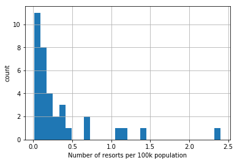
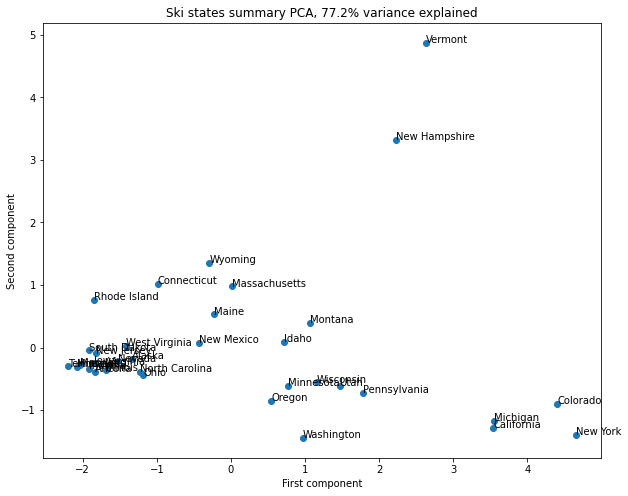
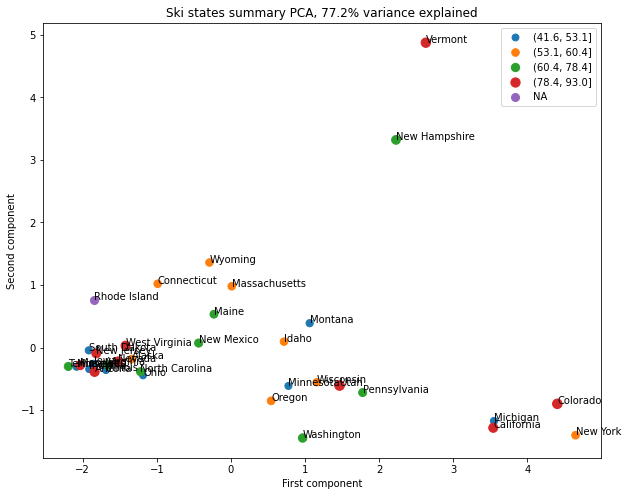
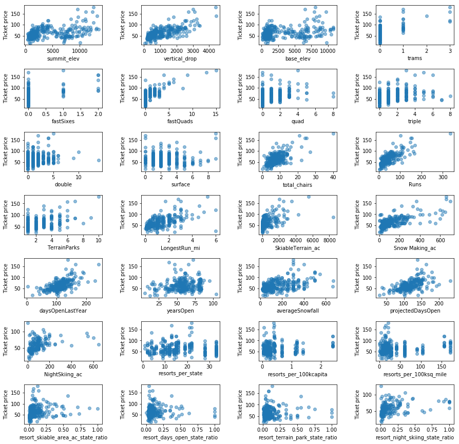
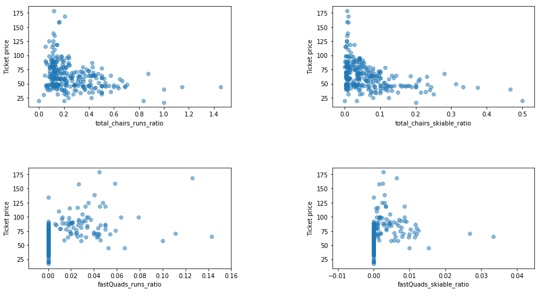

# 3 Exploratory Data Analysis<a id='3_Exploratory_Data_Analysis'></a>

## 3.1 Contents<a id='3.1_Contents'></a>
* [3 Exploratory Data Analysis](#3_Exploratory_Data_Analysis)
  * [3.1 Contents](#3.1_Contents)
  * [3.2 Introduction](#3.2_Introduction)
  * [3.3 Imports](#3.3_Imports)
  * [3.4 Load The Data](#3.4_Load_The_Data)
    * [3.4.1 Ski data](#3.4.1_Ski_data)
    * [3.4.2 State-wide summary data](#3.4.2_State-wide_summary_data)
  * [3.5 Explore The Data](#3.5_Explore_The_Data)
    * [3.5.1 Top States By Order Of Each Of The Summary Statistics](#3.5.1_Top_States_By_Order_Of_Each_Of_The_Summary_Statistics)
      * [3.5.1.1 Total state area](#3.5.1.1_Total_state_area)
      * [3.5.1.2 Total state population](#3.5.1.2_Total_state_population)
      * [3.5.1.3 Resorts per state](#3.5.1.3_Resorts_per_state)
      * [3.5.1.4 Total skiable area](#3.5.1.4_Total_skiable_area)
      * [3.5.1.5 Total night skiing area](#3.5.1.5_Total_night_skiing_area)
      * [3.5.1.6 Total days open](#3.5.1.6_Total_days_open)
    * [3.5.2 Resort density](#3.5.2_Resort_density)
      * [3.5.2.1 Top states by resort density](#3.5.2.1_Top_states_by_resort_density)
    * [3.5.3 Visualizing High Dimensional Data](#3.5.3_Visualizing_High_Dimensional_Data)
      * [3.5.3.1 Scale the data](#3.5.3.1_Scale_the_data)
        * [3.5.3.1.1 Verifying the scaling](#3.5.3.1.1_Verifying_the_scaling)
      * [3.5.3.2 Calculate the PCA transformation](#3.5.3.2_Calculate_the_PCA_transformation)
      * [3.5.3.3 Average ticket price by state](#3.5.3.3_Average_ticket_price_by_state)
      * [3.5.3.4 Adding average ticket price to scatter plot](#3.5.3.4_Adding_average_ticket_price_to_scatter_plot)
    * [3.5.4 Conclusion On How To Handle State Label](#3.5.4_Conclusion_On_How_To_Handle_State_Label)
    * [3.5.5 Ski Resort Numeric Data](#3.5.5_Ski_Resort_Numeric_Data)
      * [3.5.5.1 Feature engineering](#3.5.5.1_Feature_engineering)
      * [3.5.5.2 Feature correlation heatmap](#3.5.5.2_Feature_correlation_heatmap)
      * [3.5.5.3 Scatterplots of numeric features against ticket price](#3.5.5.3_Scatterplots_of_numeric_features_against_ticket_price)
  * [3.6 Summary](#3.6_Summary)


## 3.2 Introduction<a id='3.2_Introduction'></a>

At this point, you should have a firm idea of what your data science problem is and have the data you believe could help solve it. The business problem was a general one of modeling resort revenue. The data you started with contained some ticket price values, but with a number of missing values that led to several rows being dropped completely. You also had two kinds of ticket price. There were also some obvious issues with some of the other features in the data that, for example, led to one column being completely dropped, a data error corrected, and some other rows dropped. You also obtained some additional US state population and size data with which to augment the dataset, which also required some cleaning.

The data science problem you subsequently identified is to predict the adult weekend ticket price for ski resorts.

## 3.3 Imports<a id='3.3_Imports'></a>


```python
import pandas as pd
import numpy as np
import os
import matplotlib.pyplot as plt
import seaborn as sns
from sklearn.decomposition import PCA
from sklearn.preprocessing import scale
```

## 3.4 Load The Data<a id='3.4_Load_The_Data'></a>

### 3.4.1 Ski data<a id='3.4.1_Ski_data'></a>


```python
ski_data = pd.read_csv('../data/ski_data_cleaned.csv')
```


    ---------------------------------------------------------------------------

    FileNotFoundError                         Traceback (most recent call last)

    <ipython-input-4-e4b0f81bb31f> in <module>()
    ----> 1 ski_data = pd.read_csv('../data/ski_data_cleaned.csv')
    

    ~\Anaconda3\lib\site-packages\pandas\io\parsers.py in read_csv(filepath_or_buffer, sep, delimiter, header, names, index_col, usecols, squeeze, prefix, mangle_dupe_cols, dtype, engine, converters, true_values, false_values, skipinitialspace, skiprows, skipfooter, nrows, na_values, keep_default_na, na_filter, verbose, skip_blank_lines, parse_dates, infer_datetime_format, keep_date_col, date_parser, dayfirst, cache_dates, iterator, chunksize, compression, thousands, decimal, lineterminator, quotechar, quoting, doublequote, escapechar, comment, encoding, dialect, error_bad_lines, warn_bad_lines, delim_whitespace, low_memory, memory_map, float_precision)
        684     )
        685 
    --> 686     return _read(filepath_or_buffer, kwds)
        687 
        688 
    

    ~\Anaconda3\lib\site-packages\pandas\io\parsers.py in _read(filepath_or_buffer, kwds)
        450 
        451     # Create the parser.
    --> 452     parser = TextFileReader(fp_or_buf, **kwds)
        453 
        454     if chunksize or iterator:
    

    ~\Anaconda3\lib\site-packages\pandas\io\parsers.py in __init__(self, f, engine, **kwds)
        934             self.options["has_index_names"] = kwds["has_index_names"]
        935 
    --> 936         self._make_engine(self.engine)
        937 
        938     def close(self):
    

    ~\Anaconda3\lib\site-packages\pandas\io\parsers.py in _make_engine(self, engine)
       1166     def _make_engine(self, engine="c"):
       1167         if engine == "c":
    -> 1168             self._engine = CParserWrapper(self.f, **self.options)
       1169         else:
       1170             if engine == "python":
    

    ~\Anaconda3\lib\site-packages\pandas\io\parsers.py in __init__(self, src, **kwds)
       1996         kwds["usecols"] = self.usecols
       1997 
    -> 1998         self._reader = parsers.TextReader(src, **kwds)
       1999         self.unnamed_cols = self._reader.unnamed_cols
       2000 
    

    pandas\_libs\parsers.pyx in pandas._libs.parsers.TextReader.__cinit__()
    

    pandas\_libs\parsers.pyx in pandas._libs.parsers.TextReader._setup_parser_source()
    

    FileNotFoundError: [Errno 2] No such file or directory: '../data/ski_data_cleaned.csv'


```python
ski_data.info()
```

    <class 'pandas.core.frame.DataFrame'>
    RangeIndex: 277 entries, 0 to 276
    Data columns (total 25 columns):
     #   Column             Non-Null Count  Dtype  
    ---  ------             --------------  -----  
     0   Name               277 non-null    object 
     1   Region             277 non-null    object 
     2   state              277 non-null    object 
     3   summit_elev        277 non-null    int64  
     4   vertical_drop      277 non-null    int64  
     5   base_elev          277 non-null    int64  
     6   trams              277 non-null    int64  
     7   fastSixes          277 non-null    int64  
     8   fastQuads          277 non-null    int64  
     9   quad               277 non-null    int64  
     10  triple             277 non-null    int64  
     11  double             277 non-null    int64  
     12  surface            277 non-null    int64  
     13  total_chairs       277 non-null    int64  
     14  Runs               274 non-null    float64
     15  TerrainParks       233 non-null    float64
     16  LongestRun_mi      272 non-null    float64
     17  SkiableTerrain_ac  275 non-null    float64
     18  Snow Making_ac     240 non-null    float64
     19  daysOpenLastYear   233 non-null    float64
     20  yearsOpen          277 non-null    float64
     21  averageSnowfall    268 non-null    float64
     22  AdultWeekend       277 non-null    float64
     23  projectedDaysOpen  236 non-null    float64
     24  NightSkiing_ac     163 non-null    float64
    dtypes: float64(11), int64(11), object(3)
    memory usage: 54.2+ KB
    


```python
ski_data.head()
```


<div>
<style scoped>
    .dataframe tbody tr th:only-of-type {
        vertical-align: middle;
    }

    .dataframe tbody tr th {
        vertical-align: top;
    }

    .dataframe thead th {
        text-align: right;
    }
</style>
<table border="1" class="dataframe">
  <thead>
    <tr style="text-align: right;">
      <th></th>
      <th>Name</th>
      <th>Region</th>
      <th>state</th>
      <th>summit_elev</th>
      <th>vertical_drop</th>
      <th>base_elev</th>
      <th>trams</th>
      <th>fastSixes</th>
      <th>fastQuads</th>
      <th>quad</th>
      <th>...</th>
      <th>TerrainParks</th>
      <th>LongestRun_mi</th>
      <th>SkiableTerrain_ac</th>
      <th>Snow Making_ac</th>
      <th>daysOpenLastYear</th>
      <th>yearsOpen</th>
      <th>averageSnowfall</th>
      <th>AdultWeekend</th>
      <th>projectedDaysOpen</th>
      <th>NightSkiing_ac</th>
    </tr>
  </thead>
  <tbody>
    <tr>
      <th>0</th>
      <td>Alyeska Resort</td>
      <td>Alaska</td>
      <td>Alaska</td>
      <td>3939</td>
      <td>2500</td>
      <td>250</td>
      <td>1</td>
      <td>0</td>
      <td>2</td>
      <td>2</td>
      <td>...</td>
      <td>2.0</td>
      <td>1.0</td>
      <td>1610.0</td>
      <td>113.0</td>
      <td>150.0</td>
      <td>60.0</td>
      <td>669.0</td>
      <td>85.0</td>
      <td>150.0</td>
      <td>550.0</td>
    </tr>
    <tr>
      <th>1</th>
      <td>Eaglecrest Ski Area</td>
      <td>Alaska</td>
      <td>Alaska</td>
      <td>2600</td>
      <td>1540</td>
      <td>1200</td>
      <td>0</td>
      <td>0</td>
      <td>0</td>
      <td>0</td>
      <td>...</td>
      <td>1.0</td>
      <td>2.0</td>
      <td>640.0</td>
      <td>60.0</td>
      <td>45.0</td>
      <td>44.0</td>
      <td>350.0</td>
      <td>53.0</td>
      <td>90.0</td>
      <td>NaN</td>
    </tr>
    <tr>
      <th>2</th>
      <td>Hilltop Ski Area</td>
      <td>Alaska</td>
      <td>Alaska</td>
      <td>2090</td>
      <td>294</td>
      <td>1796</td>
      <td>0</td>
      <td>0</td>
      <td>0</td>
      <td>0</td>
      <td>...</td>
      <td>1.0</td>
      <td>1.0</td>
      <td>30.0</td>
      <td>30.0</td>
      <td>150.0</td>
      <td>36.0</td>
      <td>69.0</td>
      <td>34.0</td>
      <td>152.0</td>
      <td>30.0</td>
    </tr>
    <tr>
      <th>3</th>
      <td>Arizona Snowbowl</td>
      <td>Arizona</td>
      <td>Arizona</td>
      <td>11500</td>
      <td>2300</td>
      <td>9200</td>
      <td>0</td>
      <td>1</td>
      <td>0</td>
      <td>2</td>
      <td>...</td>
      <td>4.0</td>
      <td>2.0</td>
      <td>777.0</td>
      <td>104.0</td>
      <td>122.0</td>
      <td>81.0</td>
      <td>260.0</td>
      <td>89.0</td>
      <td>122.0</td>
      <td>NaN</td>
    </tr>
    <tr>
      <th>4</th>
      <td>Sunrise Park Resort</td>
      <td>Arizona</td>
      <td>Arizona</td>
      <td>11100</td>
      <td>1800</td>
      <td>9200</td>
      <td>0</td>
      <td>0</td>
      <td>1</td>
      <td>2</td>
      <td>...</td>
      <td>2.0</td>
      <td>1.2</td>
      <td>800.0</td>
      <td>80.0</td>
      <td>115.0</td>
      <td>49.0</td>
      <td>250.0</td>
      <td>78.0</td>
      <td>104.0</td>
      <td>80.0</td>
    </tr>
  </tbody>
</table>
<p>5 rows × 25 columns</p>
</div>


### 3.4.2 State-wide summary data<a id='3.4.2_State-wide_summary_data'></a>


```python
state_summary = pd.read_csv('data/state_summary.csv')
```


    ---------------------------------------------------------------------------

    NameError                                 Traceback (most recent call last)

    <ipython-input-2-74464b6f4568> in <module>()
    ----> 1 state_summary = pd.read_csv('data/state_summary.csv')
    

    NameError: name 'pd' is not defined


```python
state_summary.info()
```

    <class 'pandas.core.frame.DataFrame'>
    RangeIndex: 35 entries, 0 to 34
    Data columns (total 8 columns):
     #   Column                       Non-Null Count  Dtype  
    ---  ------                       --------------  -----  
     0   state                        35 non-null     object 
     1   resorts_per_state            35 non-null     int64  
     2   state_total_skiable_area_ac  35 non-null     float64
     3   state_total_days_open        35 non-null     float64
     4   state_total_terrain_parks    35 non-null     float64
     5   state_total_nightskiing_ac   35 non-null     float64
     6   state_population             35 non-null     int64  
     7   state_area_sq_miles          35 non-null     int64  
    dtypes: float64(4), int64(3), object(1)
    memory usage: 2.3+ KB
    


```python
state_summary.head()
```


<div>
<style scoped>
    .dataframe tbody tr th:only-of-type {
        vertical-align: middle;
    }

    .dataframe tbody tr th {
        vertical-align: top;
    }

    .dataframe thead th {
        text-align: right;
    }
</style>
<table border="1" class="dataframe">
  <thead>
    <tr style="text-align: right;">
      <th></th>
      <th>state</th>
      <th>resorts_per_state</th>
      <th>state_total_skiable_area_ac</th>
      <th>state_total_days_open</th>
      <th>state_total_terrain_parks</th>
      <th>state_total_nightskiing_ac</th>
      <th>state_population</th>
      <th>state_area_sq_miles</th>
    </tr>
  </thead>
  <tbody>
    <tr>
      <th>0</th>
      <td>Alaska</td>
      <td>3</td>
      <td>2280.0</td>
      <td>345.0</td>
      <td>4.0</td>
      <td>580.0</td>
      <td>731545</td>
      <td>665384</td>
    </tr>
    <tr>
      <th>1</th>
      <td>Arizona</td>
      <td>2</td>
      <td>1577.0</td>
      <td>237.0</td>
      <td>6.0</td>
      <td>80.0</td>
      <td>7278717</td>
      <td>113990</td>
    </tr>
    <tr>
      <th>2</th>
      <td>California</td>
      <td>21</td>
      <td>25948.0</td>
      <td>2738.0</td>
      <td>81.0</td>
      <td>587.0</td>
      <td>39512223</td>
      <td>163695</td>
    </tr>
    <tr>
      <th>3</th>
      <td>Colorado</td>
      <td>22</td>
      <td>43682.0</td>
      <td>3258.0</td>
      <td>74.0</td>
      <td>428.0</td>
      <td>5758736</td>
      <td>104094</td>
    </tr>
    <tr>
      <th>4</th>
      <td>Connecticut</td>
      <td>5</td>
      <td>358.0</td>
      <td>353.0</td>
      <td>10.0</td>
      <td>256.0</td>
      <td>3565278</td>
      <td>5543</td>
    </tr>
  </tbody>
</table>
</div>


## 3.5 Explore The Data<a id='3.5_Explore_The_Data'></a>

### 3.5.1 Top States By Order Of Each Of The Summary Statistics<a id='3.5.1_Top_States_By_Order_Of_Each_Of_The_Summary_Statistics'></a>

What does the state-wide picture for your market look like?


```python
state_summary_newind = state_summary.set_index('state')
```

#### 3.5.1.1 Total state area<a id='3.5.1.1_Total_state_area'></a>


```python
state_summary_newind.state_area_sq_miles.sort_values(ascending=False).head()
```


    state
    Alaska        665384
    California    163695
    Montana       147040
    New Mexico    121590
    Arizona       113990
    Name: state_area_sq_miles, dtype: int64


Your home state, Montana, comes in at third largest.

#### 3.5.1.2 Total state population<a id='3.5.1.2_Total_state_population'></a>


```python
state_summary_newind.state_population.sort_values(ascending=False).head()
```


    state
    California      39512223
    New York        19453561
    Pennsylvania    12801989
    Illinois        12671821
    Ohio            11689100
    Name: state_population, dtype: int64


California dominates the state population figures despite coming in second behind Alaska in size (by a long way). The resort's state of Montana was in the top five for size, but doesn't figure in the most populous states. Thus your state is less densely populated.

#### 3.5.1.3 Resorts per state<a id='3.5.1.3_Resorts_per_state'></a>


```python
state_summary_newind.resorts_per_state.sort_values(ascending=False).head()
```


    state
    New York        33
    Michigan        28
    Colorado        22
    California      21
    Pennsylvania    19
    Name: resorts_per_state, dtype: int64


New York comes top in the number of resorts in our market. Is this because of its proximity to wealthy New Yorkers wanting a convenient skiing trip? Or is it simply that its northerly location means there are plenty of good locations for resorts in that state?

#### 3.5.1.4 Total skiable area<a id='3.5.1.4_Total_skiable_area'></a>


```python
state_summary_newind.state_total_skiable_area_ac.sort_values(ascending=False).head()
```


    state
    Colorado      43682.0
    Utah          30508.0
    California    25948.0
    Montana       21410.0
    Idaho         16396.0
    Name: state_total_skiable_area_ac, dtype: float64


New York state may have the most resorts, but they don't account for the most skiing area. In fact, New York doesn't even make it into the top five of skiable area. Good old Montana makes it into the top five, though. You may start to think that New York has more, smaller resorts, whereas Montana has fewer, larger resorts. Colorado seems to have a name for skiing; it's in the top five for resorts and in top place for total skiable area.

#### 3.5.1.5 Total night skiing area<a id='3.5.1.5_Total_night_skiing_area'></a>


```python
state_summary_newind.state_total_nightskiing_ac.sort_values(ascending=False).head()
```


    state
    New York        2836.0
    Washington      1997.0
    Michigan        1946.0
    Pennsylvania    1528.0
    Oregon          1127.0
    Name: state_total_nightskiing_ac, dtype: float64


New York dominates the area of skiing available at night. Looking at the top five in general, they are all the more northerly states. Is night skiing in and of itself an appeal to customers, or is a consequence of simply trying to extend the skiing day where days are shorter? Is New York's domination here because it's trying to maximize its appeal to visitors who'd travel a shorter distance for a shorter visit? You'll find the data generates more (good) questions rather than answering them. This is a positive sign! You might ask your executive sponsor or data provider for some additional data about typical length of stays at these resorts, although you might end up with data that is very granular and most likely proprietary to each resort. A useful level of granularity might be "number of day tickets" and "number of weekly passes" sold.

#### 3.5.1.6 Total days open<a id='3.5.1.6_Total_days_open'></a>


```python
state_summary_newind.state_total_days_open.sort_values(ascending=False).head()
```


    state
    Colorado         3258.0
    California       2738.0
    Michigan         2389.0
    New York         2384.0
    New Hampshire    1847.0
    Name: state_total_days_open, dtype: float64


The total days open seem to bear some resemblance to the number of resorts. This is plausible. The season will only be so long, and so the more resorts open through the skiing season, the more total days open we'll see. New Hampshire makes a good effort at making it into the top five, for a small state that didn't make it into the top five of resorts per state. Does its location mean resorts there have a longer season and so stay open longer, despite there being fewer of them?

### 3.5.2 Resort density<a id='3.5.2_Resort_density'></a>

There are big states which are not necessarily the most populous. There are states that host many resorts, but other states host a larger total skiing area. The states with the most total days skiing per season are not necessarily those with the most resorts. And New York State boasts an especially large night skiing area. New York had the most resorts but wasn't in the top five largest states, so the reason for it having the most resorts can't be simply having lots of space for them. New York has the second largest population behind California. Perhaps many resorts have sprung up in New York because of the population size? Does this mean there is a high competition between resorts in New York State, fighting for customers and thus keeping prices down? You're not concerned, per se, with the absolute size or population of a state, but you could be interested in the ratio of resorts serving a given population or a given area.

So, calculate those ratios! Think of them as measures of resort density, and drop the absolute population and state size columns.


```python
# The 100_000 scaling is simply based on eyeballing the magnitudes of the data
state_summary['resorts_per_100kcapita'] = 100_000 * state_summary.resorts_per_state / state_summary.state_population
state_summary['resorts_per_100ksq_mile'] = 100_000 * state_summary.resorts_per_state / state_summary.state_area_sq_miles
state_summary.drop(columns=['state_population', 'state_area_sq_miles'], inplace=True)
state_summary.head()
```


<div>
<style scoped>
    .dataframe tbody tr th:only-of-type {
        vertical-align: middle;
    }

    .dataframe tbody tr th {
        vertical-align: top;
    }

    .dataframe thead th {
        text-align: right;
    }
</style>
<table border="1" class="dataframe">
  <thead>
    <tr style="text-align: right;">
      <th></th>
      <th>state</th>
      <th>resorts_per_state</th>
      <th>state_total_skiable_area_ac</th>
      <th>state_total_days_open</th>
      <th>state_total_terrain_parks</th>
      <th>state_total_nightskiing_ac</th>
      <th>resorts_per_100kcapita</th>
      <th>resorts_per_100ksq_mile</th>
    </tr>
  </thead>
  <tbody>
    <tr>
      <th>0</th>
      <td>Alaska</td>
      <td>3</td>
      <td>2280.0</td>
      <td>345.0</td>
      <td>4.0</td>
      <td>580.0</td>
      <td>0.410091</td>
      <td>0.450867</td>
    </tr>
    <tr>
      <th>1</th>
      <td>Arizona</td>
      <td>2</td>
      <td>1577.0</td>
      <td>237.0</td>
      <td>6.0</td>
      <td>80.0</td>
      <td>0.027477</td>
      <td>1.754540</td>
    </tr>
    <tr>
      <th>2</th>
      <td>California</td>
      <td>21</td>
      <td>25948.0</td>
      <td>2738.0</td>
      <td>81.0</td>
      <td>587.0</td>
      <td>0.053148</td>
      <td>12.828736</td>
    </tr>
    <tr>
      <th>3</th>
      <td>Colorado</td>
      <td>22</td>
      <td>43682.0</td>
      <td>3258.0</td>
      <td>74.0</td>
      <td>428.0</td>
      <td>0.382028</td>
      <td>21.134744</td>
    </tr>
    <tr>
      <th>4</th>
      <td>Connecticut</td>
      <td>5</td>
      <td>358.0</td>
      <td>353.0</td>
      <td>10.0</td>
      <td>256.0</td>
      <td>0.140242</td>
      <td>90.203861</td>
    </tr>
  </tbody>
</table>
</div>


With the removal of the two columns that only spoke to state-specific data, you now have a Dataframe that speaks to the skiing competitive landscape of each state. It has the number of resorts per state, total skiable area, and days of skiing. You've translated the plain state data into something more useful that gives you an idea of the density of resorts relative to the state population and size.

How do the distributions of these two new features look?


```python
state_summary.resorts_per_100kcapita.hist(bins=30)
plt.xlabel('Number of resorts per 100k population')
plt.ylabel('count');
```





```python
state_summary.resorts_per_100ksq_mile.hist(bins=30)
plt.xlabel('Number of resorts per 100k square miles')
plt.ylabel('count');
```


So they have quite some long tails on them, but there's definitely some structure there.

#### 3.5.2.1 Top states by resort density<a id='3.5.2.1_Top_states_by_resort_density'></a>


```python
state_summary.set_index('state').resorts_per_100kcapita.sort_values(ascending=False).head()
```


    state
    Vermont          2.403889
    Wyoming          1.382268
    New Hampshire    1.176721
    Montana          1.122778
    Idaho            0.671492
    Name: resorts_per_100kcapita, dtype: float64


```python
state_summary.set_index('state').resorts_per_100ksq_mile.sort_values(ascending=False).head()
```


    state
    New Hampshire    171.141299
    Vermont          155.990017
    Massachusetts    104.225886
    Connecticut       90.203861
    Rhode Island      64.724919
    Name: resorts_per_100ksq_mile, dtype: float64


Vermont seems particularly high in terms of resorts per capita, and both New Hampshire and Vermont top the chart for resorts per area. New York doesn't appear in either!

### 3.5.3 Visualizing High Dimensional Data<a id='3.5.3_Visualizing_High_Dimensional_Data'></a>

You may be starting to feel there's a bit of a problem here, or at least a challenge. You've constructed some potentially useful and business relevant features, derived from summary statistics, for each of the states you're concerned with. You've explored many of these features in turn and found various trends. Some states are higher in some but not in others. Some features will also be more correlated with one another than others.

One way to disentangle this interconnected web of relationships is via [principle components analysis](https://scikit-learn.org/stable/modules/generated/sklearn.decomposition.PCA.html#sklearn.decomposition.PCA) (PCA). This technique will find linear combinations of the original features that are uncorrelated with one another and order them by the amount of variance they explain. You can use these derived features to visualize the data in a lower dimension (e.g. 2 down from 7) and know how much variance the representation explains. You can also explore how the original features contribute to these derived features.

The basic steps in this process are:

1. scale the data (important here because our features are heterogenous)
2. fit the PCA transformation (learn the transformation from the data)
3. apply the transformation to the data to create the derived features
4. (optionally) use the derived features to look for patterns in the data and explore the coefficients

#### 3.5.3.1 Scale the data<a id='3.5.3.1_Scale_the_data'></a>

You only want numeric data here, although you don't want to lose track of the state labels, so it's convenient to set the state as the index.


```python
#Code task 1#
#Create a new dataframe, `state_summary_scale` from `state_summary` whilst setting the index to 'state'
state_summary_scale = state_summary.set_index('state')
#Save the state labels (using the index attribute of `state_summary_scale`) into the variable 'state_summary_index'
state_summary_index = state_summary_scale.index
#Save the column names (using the `columns` attribute) of `state_summary_scale` into the variable 'state_summary_columns'
state_summary_columns = state_summary_scale.columns
state_summary_scale.head()
```


    ---------------------------------------------------------------------------

    NameError                                 Traceback (most recent call last)

    <ipython-input-1-18ff768bac7c> in <module>()
          1 #Code task 1#
          2 #Create a new dataframe, `state_summary_scale` from `state_summary` whilst setting the index to 'state'
    ----> 3 state_summary_scale = state_summary.set_index('state')
          4 #Save the state labels (using the index attribute of `state_summary_scale`) into the variable 'state_summary_index'
          5 state_summary_index = state_summary_scale.index()
    

    NameError: name 'state_summary' is not defined


The above shows what we expect: the columns we want are all numeric and the state has been moved to the index. Although, it's not necessary to step through the sequence so laboriously, it is often good practice even for experienced professionals. It's easy to make a mistake or forget a step, or the data may have been holding out a surprise! Stepping through like this helps  validate both your work and the data!

Now use `scale()` to scale the data.


```python
state_summary_scale = scale(state_summary_scale)
```

Note, `scale()` returns an ndarray, so you lose the column names. Because you want to visualise scaled data, you already copied the column names. Now you can construct a dataframe from the ndarray here and reintroduce the column names.


```python
#Code task 2#
#Create a new dataframe from `state_summary_scale` using the column names we saved in `state_summary_columns`
state_summary_scaled_df = pd.DataFrame(state_summary_scale, columns=state_summary_columns)
state_summary_scaled_df.head()
```

##### 3.5.3.1.1 Verifying the scaling<a id='3.5.3.1.1_Verifying_the_scaling'></a>

This is definitely going the extra mile for validating your steps, but provides a worthwhile lesson.

First of all, check the mean of the scaled features using panda's `mean()` DataFrame method.


```python
#Code task 3#
#Call `state_summary_scaled_df`'s `mean()` method
state_summary_scaled_df.mean()
```

This is pretty much zero!

Perform a similar check for the standard deviation using pandas's `std()` DataFrame method.


```python
#Code task 4#
#Call `state_summary_scaled_df`'s `std()` method
state_summary_scaled_df.std()
```

Well, this is a little embarrassing. The numbers should be closer to 1 than this! Check the documentation for [scale](https://scikit-learn.org/stable/modules/generated/sklearn.preprocessing.scale.html) to see if you used it right. What about [std](https://pandas.pydata.org/pandas-docs/stable/reference/api/pandas.DataFrame.std.html), did you mess up there? Is one of them not working right?

The keen observer, who already has some familiarity with statistical inference and biased estimators, may have noticed what's happened here. `scale()` uses the biased estimator for standard deviation (ddof=0). This doesn't mean it's bad! It simply means it calculates the standard deviation of the sample it was given. The `std()` method, on the other hand, defaults to using ddof=1, that is it's normalized by N-1. In other words, the `std()` method default is to assume you want your best estimate of the population parameter based on the given sample. You can tell it to return the biased estimate instead:


```python
#Code task 5#
#Repeat the previous call to `std()` but pass in ddof=0 
state_summary_scaled_df.std(ddof=0)
```

There! Now it agrees with `scale()` and our expectation. This just goes to show different routines to do ostensibly the same thing can have different behaviours. Good practice is to keep validating your work and checking the documentation!

#### 3.5.3.2 Calculate the PCA transformation<a id='3.5.3.2_Calculate_the_PCA_transformation'></a>

Fit the PCA transformation using the scaled data.


```python
state_pca = PCA().fit(state_summary_scale)
```

Plot the cumulative variance ratio with number of components.


```python
#Code task 6#
#Call the `cumsum()` method on the 'explained_variance_ratio_' attribute of `state_pca` and
#create a line plot to visualize the cumulative explained variance ratio with number of components
#Set the xlabel to 'Component #', the ylabel to 'Cumulative ratio variance', and the
#title to 'Cumulative variance ratio explained by PCA components for state/resort summary statistics'
#Hint: remember the handy ';' at the end of the last plot call to suppress that untidy output
plt.subplots(figsize=(10, 6))
plt.plot(state_pca.explained_variance_ratio_.cumsum())
plt.xlabel('Component #')
plt.ylabel('Cumulative ratio variance')
plt.title('Cumulative variance ratio explained by PCA components for state/resort summary statistics');
```

The first two components seem to account for over 75% of the variance, and the first four for over 95%.

**Note:** It is important to move quickly when performing exploratory data analysis. You should not spend hours trying to create publication-ready figures. However, it is crucially important that you can easily review and summarise the findings from EDA. Descriptive axis labels and titles are _extremely_ useful here. When you come to reread your notebook to summarise your findings, you will be thankful that you created descriptive plots and even made key observations in adjacent markdown cells.

Apply the transformation to the data to obtain the derived features.


```python
#Code task 7#
#Call `state_pca`'s `transform()` method, passing in `state_summary_scale` as its argument
state_pca_x = state_pca.transform(state_summary_scale)
```


```python
state_pca_x.shape
```


    (35, 7)


Plot the first two derived features (the first two principle components) and label each point with the name of the state.

Take a moment to familiarize yourself with the code below. It will extract the first and second columns from the transformed data (`state_pca_x`) as x and y coordinates for plotting. Recall the state labels you saved (for this purpose) for subsequent calls to `plt.annotate`. Grab the second (index 1) value of the cumulative variance ratio to include in your descriptive title; this helpfully highlights the percentage variance explained
by the two PCA components you're visualizing. Then create an appropriately sized and well-labelled scatterplot
to convey all of this information.


```python
x = state_pca_x[:, 0]
y = state_pca_x[:, 1]
state = state_summary_index
pc_var = 100 * state_pca.explained_variance_ratio_.cumsum()[1]
plt.subplots(figsize=(10,8))
plt.scatter(x=x, y=y)
plt.xlabel('First component')
plt.ylabel('Second component')
plt.title(f'Ski states summary PCA, {pc_var:.1f}% variance explained')
for s, x, y in zip(state, x, y):
    plt.annotate(s, (x, y))
```





#### 3.5.3.3 Average ticket price by state<a id='3.5.3.3_Average_ticket_price_by_state'></a>

Here, all point markers for the states are the same size and colour. You've visualized relationships between the states based on features such as the total skiable terrain area, but your ultimate interest lies in ticket prices. You know ticket prices for resorts in each state, so it might be interesting to see if there's any pattern there.


```python
#Code task 8#
#Calculate the average 'AdultWeekend' ticket price by state
state_avg_price = ski_data.groupby(state)['AdultWeekend'].mean()
state_avg_price.head()
```


```python
state_avg_price.hist(bins=30)
plt.title('Distribution of state averaged prices')
plt.xlabel('Mean state adult weekend ticket price')
plt.ylabel('count');
```


#### 3.5.3.4 Adding average ticket price to scatter plot<a id='3.5.3.4_Adding_average_ticket_price_to_scatter_plot'></a>

At this point you have several objects floating around. You have just calculated average ticket price by state from our ski resort data, but you've been looking at principle components generated from other state summary data. We extracted indexes and column names from a dataframe and the first two principle components from an array. It's becoming a bit hard to keep track of them all. You'll create a new DataFrame to do this.


```python
#Code task 9#
#Create a dataframe containing the values of the first two PCA components
#Remember the first component was given by state_pca_x[:, 0],
#and the second by state_pca_x[:, 1]
#Call these 'PC1' and 'PC2', respectively and set the dataframe index to `state_summary_index`
pca_df = pd.DataFrame({'PC1': state_pca_x[:, 0], 'PC2': state_pca_x[:, 1]}, index=state_summary_index)
pca_df.head()
```

That worked, and you have state as an index.


```python
# our average state prices also have state as an index
state_avg_price.head()
```


    state
    Alaska         57.333333
    Arizona        83.500000
    California     81.416667
    Colorado       90.714286
    Connecticut    56.800000
    Name: AdultWeekend, dtype: float64


```python
# we can also cast it to a dataframe using Series' to_frame() method:
state_avg_price.to_frame().head()
```


<div>
<style scoped>
    .dataframe tbody tr th:only-of-type {
        vertical-align: middle;
    }

    .dataframe tbody tr th {
        vertical-align: top;
    }

    .dataframe thead th {
        text-align: right;
    }
</style>
<table border="1" class="dataframe">
  <thead>
    <tr style="text-align: right;">
      <th></th>
      <th>AdultWeekend</th>
    </tr>
    <tr>
      <th>state</th>
      <th></th>
    </tr>
  </thead>
  <tbody>
    <tr>
      <th>Alaska</th>
      <td>57.333333</td>
    </tr>
    <tr>
      <th>Arizona</th>
      <td>83.500000</td>
    </tr>
    <tr>
      <th>California</th>
      <td>81.416667</td>
    </tr>
    <tr>
      <th>Colorado</th>
      <td>90.714286</td>
    </tr>
    <tr>
      <th>Connecticut</th>
      <td>56.800000</td>
    </tr>
  </tbody>
</table>
</div>


Now you can concatenate both parts on axis 1 and using the indexes.


```python
#Code task 10#
#Use pd.concat to concatenate `pca_df` and `state_avg_price` along axis 1
# remember, pd.concat will align on index
pca_df = concat([pca_df, state_avg_price], axis=1)
pca_df.head()
```

You saw some range in average ticket price histogram above, but it may be hard to pick out differences if you're thinking of using the value for point size. You'll add another column where you seperate these prices into quartiles; that might show something.


```python
pca_df['Quartile'] = pd.qcut(pca_df.AdultWeekend, q=4, precision=1)
pca_df.head()
```


<div>
<style scoped>
    .dataframe tbody tr th:only-of-type {
        vertical-align: middle;
    }

    .dataframe tbody tr th {
        vertical-align: top;
    }

    .dataframe thead th {
        text-align: right;
    }
</style>
<table border="1" class="dataframe">
  <thead>
    <tr style="text-align: right;">
      <th></th>
      <th>PC1</th>
      <th>PC2</th>
      <th>AdultWeekend</th>
      <th>Quartile</th>
    </tr>
  </thead>
  <tbody>
    <tr>
      <th>Alaska</th>
      <td>-1.336533</td>
      <td>-0.182208</td>
      <td>57.333333</td>
      <td>(53.1, 60.4]</td>
    </tr>
    <tr>
      <th>Arizona</th>
      <td>-1.839049</td>
      <td>-0.387959</td>
      <td>83.500000</td>
      <td>(78.4, 93.0]</td>
    </tr>
    <tr>
      <th>California</th>
      <td>3.537857</td>
      <td>-1.282509</td>
      <td>81.416667</td>
      <td>(78.4, 93.0]</td>
    </tr>
    <tr>
      <th>Colorado</th>
      <td>4.402210</td>
      <td>-0.898855</td>
      <td>90.714286</td>
      <td>(78.4, 93.0]</td>
    </tr>
    <tr>
      <th>Connecticut</th>
      <td>-0.988027</td>
      <td>1.020218</td>
      <td>56.800000</td>
      <td>(53.1, 60.4]</td>
    </tr>
  </tbody>
</table>
</div>


```python
# Note that Quartile is a new data type: category
# This will affect how we handle it later on
pca_df.dtypes
```


    PC1              float64
    PC2              float64
    AdultWeekend     float64
    Quartile        category
    dtype: object


This looks great. But, let's have a healthy paranoia about it. You've just created a whole new DataFrame by combining information. Do we have any missing values? It's a narrow DataFrame, only four columns, so you'll just print out any rows that have any null values, expecting an empty DataFrame.


```python
pca_df[pca_df.isnull().any(axis=1)]
```


<div>
<style scoped>
    .dataframe tbody tr th:only-of-type {
        vertical-align: middle;
    }

    .dataframe tbody tr th {
        vertical-align: top;
    }

    .dataframe thead th {
        text-align: right;
    }
</style>
<table border="1" class="dataframe">
  <thead>
    <tr style="text-align: right;">
      <th></th>
      <th>PC1</th>
      <th>PC2</th>
      <th>AdultWeekend</th>
      <th>Quartile</th>
    </tr>
  </thead>
  <tbody>
    <tr>
      <th>Rhode Island</th>
      <td>-1.843646</td>
      <td>0.761339</td>
      <td>NaN</td>
      <td>NaN</td>
    </tr>
  </tbody>
</table>
</div>


Ah, Rhode Island. How has this happened? Recall you created the original ski resort state summary dataset in the previous step before removing resorts with missing prices. This made sense because you wanted to capture all the other available information. However, Rhode Island only had one resort and its price was missing. You have two choices here. If you're interested in looking for any pattern with price, drop this row. But you are also generally interested in any clusters or trends, then you'd like to see Rhode Island even if the ticket price is unknown. So, replace these missing values to make it easier to handle/display them.

Because `Quartile` is a category type, there's an extra step here. Add the category (the string 'NA') that you're going to use as a replacement.


```python
pca_df['AdultWeekend'].fillna(pca_df.AdultWeekend.mean(), inplace=True)
pca_df['Quartile'] = pca_df['Quartile'].cat.add_categories('NA')
pca_df['Quartile'].fillna('NA', inplace=True)
pca_df.loc['Rhode Island']
```


    PC1             -1.84365
    PC2             0.761339
    AdultWeekend     64.1244
    Quartile              NA
    Name: Rhode Island, dtype: object


Note, in the above Quartile has the string value 'NA' that you inserted. This is different to `numpy`'s NaN type.

You now have enough information to recreate the scatterplot, now adding marker size for ticket price and colour for the discrete quartile.

Notice in the code below how you're iterating over each quartile and plotting the points in the same quartile group as one. This gives a list of quartiles for an informative legend with points coloured by quartile and sized by ticket price (higher prices are represented by larger point markers).


```python
x = pca_df.PC1
y = pca_df.PC2
price = pca_df.AdultWeekend
quartiles = pca_df.Quartile
state = pca_df.index
pc_var = 100 * state_pca.explained_variance_ratio_.cumsum()[1]
fig, ax = plt.subplots(figsize=(10,8))
for q in quartiles.cat.categories:
    im = quartiles == q
    ax.scatter(x=x[im], y=y[im], s=price[im], label=q)
ax.set_xlabel('First component')
ax.set_ylabel('Second component')
plt.legend()
ax.set_title(f'Ski states summary PCA, {pc_var:.1f}% variance explained')
for s, x, y in zip(state, x, y):
    plt.annotate(s, (x, y))
```





Now, you see the same distribution of states as before, but with additional information about the average price. There isn't an obvious pattern. The red points representing the upper quartile of price can be seen to the left, the right, and up top. There's also a spread of the other quartiles as well. In this representation of the ski summaries for each state, which accounts for some 77% of the variance, you simply do not seeing a pattern with price.

The above scatterplot was created using matplotlib. This is powerful, but took quite a bit of effort to set up. You have to iterate over the categories, plotting each separately, to get a colour legend. You can also tell that the points in the legend have different sizes as well as colours. As it happens, the size and the colour will be a 1:1 mapping here, so it happily works for us here. If we were using size and colour to display fundamentally different aesthetics, you'd have a lot more work to do. So matplotlib is powerful, but not ideally suited to when we want to visually explore multiple features as here (and intelligent use of colour, point size, and even shape can be incredibly useful for EDA).

Fortunately, there's another option: seaborn. You saw seaborn in action in the previous notebook, when you wanted to distinguish between weekend and weekday ticket prices in the boxplot. After melting the dataframe to have ticket price as a single column with the ticket type represented in a new column, you asked seaborn to create separate boxes for each type.


```python
#Code task 11#
#Create a seaborn scatterplot by calling `sns.scatterplot`
#Specify the dataframe pca_df as the source of the data,
#specify 'PC1' for x and 'PC2' for y,
#specify 'AdultWeekend' for the pointsize (scatterplot's `size` argument),
#specify 'Quartile' for `hue`
#specify pca_df.Quartile.cat.categories for `hue_order` - what happens with/without this?
x = pca_df.PC1
y = pca_df.PC2
state = pca_df.index
plt.subplots(figsize=(12, 10))
# Note the argument below to make sure we get the colours in the ascending
# order we intuitively expect!
sns.scatterplot(x='PC1', y='PC2', size='AdultWeekend', hue='Quartile', 
                hue_order=pca_df.Quartile.cat.categories, data=pca_df)
#and we can still annotate with the state labels
for s, x, y in zip(state, x, y):
    plt.annotate(s, (x, y))   
plt.title(f'Ski states summary PCA, {pc_var:.1f}% variance explained');
```

Seaborn does more! You should always care about your output. What if you want the ordering of the colours in the legend to align intuitively with the ordering of the quartiles? Add a `hue_order` argument! Seaborn has thrown in a few nice other things:

* the aesthetics are separated in the legend
* it defaults to marker sizes that provide more contrast (smaller to larger)
* when starting with a DataFrame, you have less work to do to visualize patterns in the data

The last point is important. Less work means less chance of mixing up objects and jumping to erroneous conclusions. This also emphasizes the importance of getting data into a suitable DataFrame. In the previous notebook, you `melt`ed the data to make it longer, but with fewer columns, in order to get a single column of price with a new column representing a categorical feature you'd want to use. A **key skill** is being able to wrangle data into a form most suited to the particular use case.

Having gained a good visualization of the state summary data, you can discuss and follow up on your findings.

In the first two components, there is a spread of states across the first component. It looks like Vermont and New Hampshire might be off on their own a little in the second dimension, although they're really no more extreme than New York and Colorado are in the first dimension. But if you were curious, could you get an idea what it is that pushes Vermont and New Hampshire up?

The `components_` attribute of the fitted PCA object tell us how important (and in what direction) each feature contributes to each score (or coordinate on the plot). **NB we were sensible and scaled our original features (to zero mean and unit variance)**. You may not always be interested in interpreting the coefficients of the PCA transformation in this way, although it's more likely you will when using PCA for EDA as opposed to a preprocessing step as part of a machine learning pipeline. The attribute is actually a numpy ndarray, and so has been stripped of helpful index and column names. Fortunately, you thought ahead and saved these. This is how we were able to annotate the scatter plots above. It also means you can construct a DataFrame of `components_` with the feature names for context:


```python
pd.DataFrame(state_pca.components_, columns=state_summary_columns)
```


<div>
<style scoped>
    .dataframe tbody tr th:only-of-type {
        vertical-align: middle;
    }

    .dataframe tbody tr th {
        vertical-align: top;
    }

    .dataframe thead th {
        text-align: right;
    }
</style>
<table border="1" class="dataframe">
  <thead>
    <tr style="text-align: right;">
      <th></th>
      <th>resorts_per_state</th>
      <th>state_total_skiable_area_ac</th>
      <th>state_total_days_open</th>
      <th>state_total_terrain_parks</th>
      <th>state_total_nightskiing_ac</th>
      <th>resorts_per_100kcapita</th>
      <th>resorts_per_100ksq_mile</th>
    </tr>
  </thead>
  <tbody>
    <tr>
      <th>0</th>
      <td>0.486079</td>
      <td>0.318224</td>
      <td>0.489997</td>
      <td>0.488420</td>
      <td>0.334398</td>
      <td>0.187154</td>
      <td>0.192250</td>
    </tr>
    <tr>
      <th>1</th>
      <td>-0.085092</td>
      <td>-0.142204</td>
      <td>-0.045071</td>
      <td>-0.041939</td>
      <td>-0.351064</td>
      <td>0.662458</td>
      <td>0.637691</td>
    </tr>
    <tr>
      <th>2</th>
      <td>-0.177937</td>
      <td>0.714835</td>
      <td>0.115200</td>
      <td>0.005509</td>
      <td>-0.511255</td>
      <td>0.220359</td>
      <td>-0.366207</td>
    </tr>
    <tr>
      <th>3</th>
      <td>0.056163</td>
      <td>-0.118347</td>
      <td>-0.162625</td>
      <td>-0.177072</td>
      <td>0.438912</td>
      <td>0.685417</td>
      <td>-0.512443</td>
    </tr>
    <tr>
      <th>4</th>
      <td>-0.209186</td>
      <td>0.573462</td>
      <td>-0.250521</td>
      <td>-0.388608</td>
      <td>0.499801</td>
      <td>-0.065077</td>
      <td>0.399461</td>
    </tr>
    <tr>
      <th>5</th>
      <td>-0.818390</td>
      <td>-0.092319</td>
      <td>0.238198</td>
      <td>0.448118</td>
      <td>0.246196</td>
      <td>0.058911</td>
      <td>-0.009146</td>
    </tr>
    <tr>
      <th>6</th>
      <td>-0.090273</td>
      <td>-0.127021</td>
      <td>0.773728</td>
      <td>-0.613576</td>
      <td>0.022185</td>
      <td>-0.007887</td>
      <td>-0.005631</td>
    </tr>
  </tbody>
</table>
</div>


For the row associated with the second component, are there any large values?

It looks like `resorts_per_100kcapita` and `resorts_per_100ksq_mile` might count for quite a lot, in a positive sense. Be aware that sign matters; a large negative coefficient multiplying a large negative feature will actually produce a large positive PCA score.


```python
state_summary[state_summary.state.isin(['New Hampshire', 'Vermont'])].T
```


<div>
<style scoped>
    .dataframe tbody tr th:only-of-type {
        vertical-align: middle;
    }

    .dataframe tbody tr th {
        vertical-align: top;
    }

    .dataframe thead th {
        text-align: right;
    }
</style>
<table border="1" class="dataframe">
  <thead>
    <tr style="text-align: right;">
      <th></th>
      <th>17</th>
      <th>29</th>
    </tr>
  </thead>
  <tbody>
    <tr>
      <th>state</th>
      <td>New Hampshire</td>
      <td>Vermont</td>
    </tr>
    <tr>
      <th>resorts_per_state</th>
      <td>16</td>
      <td>15</td>
    </tr>
    <tr>
      <th>state_total_skiable_area_ac</th>
      <td>3427</td>
      <td>7239</td>
    </tr>
    <tr>
      <th>state_total_days_open</th>
      <td>1847</td>
      <td>1777</td>
    </tr>
    <tr>
      <th>state_total_terrain_parks</th>
      <td>43</td>
      <td>50</td>
    </tr>
    <tr>
      <th>state_total_nightskiing_ac</th>
      <td>376</td>
      <td>50</td>
    </tr>
    <tr>
      <th>resorts_per_100kcapita</th>
      <td>1.17672</td>
      <td>2.40389</td>
    </tr>
    <tr>
      <th>resorts_per_100ksq_mile</th>
      <td>171.141</td>
      <td>155.99</td>
    </tr>
  </tbody>
</table>
</div>


```python
state_summary_scaled_df[state_summary.state.isin(['New Hampshire', 'Vermont'])].T
```


<div>
<style scoped>
    .dataframe tbody tr th:only-of-type {
        vertical-align: middle;
    }

    .dataframe tbody tr th {
        vertical-align: top;
    }

    .dataframe thead th {
        text-align: right;
    }
</style>
<table border="1" class="dataframe">
  <thead>
    <tr style="text-align: right;">
      <th></th>
      <th>17</th>
      <th>29</th>
    </tr>
  </thead>
  <tbody>
    <tr>
      <th>resorts_per_state</th>
      <td>0.839478</td>
      <td>0.712833</td>
    </tr>
    <tr>
      <th>state_total_skiable_area_ac</th>
      <td>-0.277128</td>
      <td>0.104681</td>
    </tr>
    <tr>
      <th>state_total_days_open</th>
      <td>1.118608</td>
      <td>1.034363</td>
    </tr>
    <tr>
      <th>state_total_terrain_parks</th>
      <td>0.921793</td>
      <td>1.233725</td>
    </tr>
    <tr>
      <th>state_total_nightskiing_ac</th>
      <td>-0.245050</td>
      <td>-0.747570</td>
    </tr>
    <tr>
      <th>resorts_per_100kcapita</th>
      <td>1.711066</td>
      <td>4.226572</td>
    </tr>
    <tr>
      <th>resorts_per_100ksq_mile</th>
      <td>3.483281</td>
      <td>3.112841</td>
    </tr>
  </tbody>
</table>
</div>


So, yes, both states have particularly large values of `resorts_per_100ksq_mile` in absolute terms, and these put them more than 3 standard deviations from the mean. Vermont also has a notably large value for `resorts_per_100kcapita`. New York, then, does not seem to be a stand-out for density of ski resorts either in terms of state size or population count.

### 3.5.4 Conclusion On How To Handle State Label<a id='3.5.4_Conclusion_On_How_To_Handle_State_Label'></a>

You can offer some justification for treating all states equally, and work towards building a pricing model that considers all states together, without treating any one particularly specially. You haven't seen any clear grouping yet, but you have captured potentially relevant state data in features most likely to be relevant to your business use case. This answers a big question!

### 3.5.5 Ski Resort Numeric Data<a id='3.5.5_Ski_Resort_Numeric_Data'></a>

After what may feel a detour, return to examining the ski resort data. It's worth noting, the previous EDA was valuable because it's given us some potentially useful features, as well as validating an approach for how to subsequently handle the state labels in your modeling.


```python
ski_data.head().T
```


<div>
<style scoped>
    .dataframe tbody tr th:only-of-type {
        vertical-align: middle;
    }

    .dataframe tbody tr th {
        vertical-align: top;
    }

    .dataframe thead th {
        text-align: right;
    }
</style>
<table border="1" class="dataframe">
  <thead>
    <tr style="text-align: right;">
      <th></th>
      <th>0</th>
      <th>1</th>
      <th>2</th>
      <th>3</th>
      <th>4</th>
    </tr>
  </thead>
  <tbody>
    <tr>
      <th>Name</th>
      <td>Alyeska Resort</td>
      <td>Eaglecrest Ski Area</td>
      <td>Hilltop Ski Area</td>
      <td>Arizona Snowbowl</td>
      <td>Sunrise Park Resort</td>
    </tr>
    <tr>
      <th>Region</th>
      <td>Alaska</td>
      <td>Alaska</td>
      <td>Alaska</td>
      <td>Arizona</td>
      <td>Arizona</td>
    </tr>
    <tr>
      <th>state</th>
      <td>Alaska</td>
      <td>Alaska</td>
      <td>Alaska</td>
      <td>Arizona</td>
      <td>Arizona</td>
    </tr>
    <tr>
      <th>summit_elev</th>
      <td>3939</td>
      <td>2600</td>
      <td>2090</td>
      <td>11500</td>
      <td>11100</td>
    </tr>
    <tr>
      <th>vertical_drop</th>
      <td>2500</td>
      <td>1540</td>
      <td>294</td>
      <td>2300</td>
      <td>1800</td>
    </tr>
    <tr>
      <th>base_elev</th>
      <td>250</td>
      <td>1200</td>
      <td>1796</td>
      <td>9200</td>
      <td>9200</td>
    </tr>
    <tr>
      <th>trams</th>
      <td>1</td>
      <td>0</td>
      <td>0</td>
      <td>0</td>
      <td>0</td>
    </tr>
    <tr>
      <th>fastSixes</th>
      <td>0</td>
      <td>0</td>
      <td>0</td>
      <td>1</td>
      <td>0</td>
    </tr>
    <tr>
      <th>fastQuads</th>
      <td>2</td>
      <td>0</td>
      <td>0</td>
      <td>0</td>
      <td>1</td>
    </tr>
    <tr>
      <th>quad</th>
      <td>2</td>
      <td>0</td>
      <td>0</td>
      <td>2</td>
      <td>2</td>
    </tr>
    <tr>
      <th>triple</th>
      <td>0</td>
      <td>0</td>
      <td>1</td>
      <td>2</td>
      <td>3</td>
    </tr>
    <tr>
      <th>double</th>
      <td>0</td>
      <td>4</td>
      <td>0</td>
      <td>1</td>
      <td>1</td>
    </tr>
    <tr>
      <th>surface</th>
      <td>2</td>
      <td>0</td>
      <td>2</td>
      <td>2</td>
      <td>0</td>
    </tr>
    <tr>
      <th>total_chairs</th>
      <td>7</td>
      <td>4</td>
      <td>3</td>
      <td>8</td>
      <td>7</td>
    </tr>
    <tr>
      <th>Runs</th>
      <td>76</td>
      <td>36</td>
      <td>13</td>
      <td>55</td>
      <td>65</td>
    </tr>
    <tr>
      <th>TerrainParks</th>
      <td>2</td>
      <td>1</td>
      <td>1</td>
      <td>4</td>
      <td>2</td>
    </tr>
    <tr>
      <th>LongestRun_mi</th>
      <td>1</td>
      <td>2</td>
      <td>1</td>
      <td>2</td>
      <td>1.2</td>
    </tr>
    <tr>
      <th>SkiableTerrain_ac</th>
      <td>1610</td>
      <td>640</td>
      <td>30</td>
      <td>777</td>
      <td>800</td>
    </tr>
    <tr>
      <th>Snow Making_ac</th>
      <td>113</td>
      <td>60</td>
      <td>30</td>
      <td>104</td>
      <td>80</td>
    </tr>
    <tr>
      <th>daysOpenLastYear</th>
      <td>150</td>
      <td>45</td>
      <td>150</td>
      <td>122</td>
      <td>115</td>
    </tr>
    <tr>
      <th>yearsOpen</th>
      <td>60</td>
      <td>44</td>
      <td>36</td>
      <td>81</td>
      <td>49</td>
    </tr>
    <tr>
      <th>averageSnowfall</th>
      <td>669</td>
      <td>350</td>
      <td>69</td>
      <td>260</td>
      <td>250</td>
    </tr>
    <tr>
      <th>AdultWeekend</th>
      <td>85</td>
      <td>53</td>
      <td>34</td>
      <td>89</td>
      <td>78</td>
    </tr>
    <tr>
      <th>projectedDaysOpen</th>
      <td>150</td>
      <td>90</td>
      <td>152</td>
      <td>122</td>
      <td>104</td>
    </tr>
    <tr>
      <th>NightSkiing_ac</th>
      <td>550</td>
      <td>NaN</td>
      <td>30</td>
      <td>NaN</td>
      <td>80</td>
    </tr>
  </tbody>
</table>
</div>


#### 3.5.5.1 Feature engineering<a id='3.5.5.1_Feature_engineering'></a>

Having previously spent some time exploring the state summary data you derived, you now start to explore the resort-level data in more detail. This can help guide you on how (or whether) to use the state labels in the data. It's now time to merge the two datasets and engineer some intuitive features. For example, you can engineer a resort's share of the supply for a given state.


```python
state_summary.head()
```


<div>
<style scoped>
    .dataframe tbody tr th:only-of-type {
        vertical-align: middle;
    }

    .dataframe tbody tr th {
        vertical-align: top;
    }

    .dataframe thead th {
        text-align: right;
    }
</style>
<table border="1" class="dataframe">
  <thead>
    <tr style="text-align: right;">
      <th></th>
      <th>state</th>
      <th>resorts_per_state</th>
      <th>state_total_skiable_area_ac</th>
      <th>state_total_days_open</th>
      <th>state_total_terrain_parks</th>
      <th>state_total_nightskiing_ac</th>
      <th>resorts_per_100kcapita</th>
      <th>resorts_per_100ksq_mile</th>
    </tr>
  </thead>
  <tbody>
    <tr>
      <th>0</th>
      <td>Alaska</td>
      <td>3</td>
      <td>2280.0</td>
      <td>345.0</td>
      <td>4.0</td>
      <td>580.0</td>
      <td>0.410091</td>
      <td>0.450867</td>
    </tr>
    <tr>
      <th>1</th>
      <td>Arizona</td>
      <td>2</td>
      <td>1577.0</td>
      <td>237.0</td>
      <td>6.0</td>
      <td>80.0</td>
      <td>0.027477</td>
      <td>1.754540</td>
    </tr>
    <tr>
      <th>2</th>
      <td>California</td>
      <td>21</td>
      <td>25948.0</td>
      <td>2738.0</td>
      <td>81.0</td>
      <td>587.0</td>
      <td>0.053148</td>
      <td>12.828736</td>
    </tr>
    <tr>
      <th>3</th>
      <td>Colorado</td>
      <td>22</td>
      <td>43682.0</td>
      <td>3258.0</td>
      <td>74.0</td>
      <td>428.0</td>
      <td>0.382028</td>
      <td>21.134744</td>
    </tr>
    <tr>
      <th>4</th>
      <td>Connecticut</td>
      <td>5</td>
      <td>358.0</td>
      <td>353.0</td>
      <td>10.0</td>
      <td>256.0</td>
      <td>0.140242</td>
      <td>90.203861</td>
    </tr>
  </tbody>
</table>
</div>


```python
# DataFrame's merge method provides SQL-like joins
# here 'state' is a column (not an index)
ski_data = ski_data.merge(state_summary, how='left', on='state')
ski_data.head().T
```


<div>
<style scoped>
    .dataframe tbody tr th:only-of-type {
        vertical-align: middle;
    }

    .dataframe tbody tr th {
        vertical-align: top;
    }

    .dataframe thead th {
        text-align: right;
    }
</style>
<table border="1" class="dataframe">
  <thead>
    <tr style="text-align: right;">
      <th></th>
      <th>0</th>
      <th>1</th>
      <th>2</th>
      <th>3</th>
      <th>4</th>
    </tr>
  </thead>
  <tbody>
    <tr>
      <th>Name</th>
      <td>Alyeska Resort</td>
      <td>Eaglecrest Ski Area</td>
      <td>Hilltop Ski Area</td>
      <td>Arizona Snowbowl</td>
      <td>Sunrise Park Resort</td>
    </tr>
    <tr>
      <th>Region</th>
      <td>Alaska</td>
      <td>Alaska</td>
      <td>Alaska</td>
      <td>Arizona</td>
      <td>Arizona</td>
    </tr>
    <tr>
      <th>state</th>
      <td>Alaska</td>
      <td>Alaska</td>
      <td>Alaska</td>
      <td>Arizona</td>
      <td>Arizona</td>
    </tr>
    <tr>
      <th>summit_elev</th>
      <td>3939</td>
      <td>2600</td>
      <td>2090</td>
      <td>11500</td>
      <td>11100</td>
    </tr>
    <tr>
      <th>vertical_drop</th>
      <td>2500</td>
      <td>1540</td>
      <td>294</td>
      <td>2300</td>
      <td>1800</td>
    </tr>
    <tr>
      <th>base_elev</th>
      <td>250</td>
      <td>1200</td>
      <td>1796</td>
      <td>9200</td>
      <td>9200</td>
    </tr>
    <tr>
      <th>trams</th>
      <td>1</td>
      <td>0</td>
      <td>0</td>
      <td>0</td>
      <td>0</td>
    </tr>
    <tr>
      <th>fastSixes</th>
      <td>0</td>
      <td>0</td>
      <td>0</td>
      <td>1</td>
      <td>0</td>
    </tr>
    <tr>
      <th>fastQuads</th>
      <td>2</td>
      <td>0</td>
      <td>0</td>
      <td>0</td>
      <td>1</td>
    </tr>
    <tr>
      <th>quad</th>
      <td>2</td>
      <td>0</td>
      <td>0</td>
      <td>2</td>
      <td>2</td>
    </tr>
    <tr>
      <th>triple</th>
      <td>0</td>
      <td>0</td>
      <td>1</td>
      <td>2</td>
      <td>3</td>
    </tr>
    <tr>
      <th>double</th>
      <td>0</td>
      <td>4</td>
      <td>0</td>
      <td>1</td>
      <td>1</td>
    </tr>
    <tr>
      <th>surface</th>
      <td>2</td>
      <td>0</td>
      <td>2</td>
      <td>2</td>
      <td>0</td>
    </tr>
    <tr>
      <th>total_chairs</th>
      <td>7</td>
      <td>4</td>
      <td>3</td>
      <td>8</td>
      <td>7</td>
    </tr>
    <tr>
      <th>Runs</th>
      <td>76</td>
      <td>36</td>
      <td>13</td>
      <td>55</td>
      <td>65</td>
    </tr>
    <tr>
      <th>TerrainParks</th>
      <td>2</td>
      <td>1</td>
      <td>1</td>
      <td>4</td>
      <td>2</td>
    </tr>
    <tr>
      <th>LongestRun_mi</th>
      <td>1</td>
      <td>2</td>
      <td>1</td>
      <td>2</td>
      <td>1.2</td>
    </tr>
    <tr>
      <th>SkiableTerrain_ac</th>
      <td>1610</td>
      <td>640</td>
      <td>30</td>
      <td>777</td>
      <td>800</td>
    </tr>
    <tr>
      <th>Snow Making_ac</th>
      <td>113</td>
      <td>60</td>
      <td>30</td>
      <td>104</td>
      <td>80</td>
    </tr>
    <tr>
      <th>daysOpenLastYear</th>
      <td>150</td>
      <td>45</td>
      <td>150</td>
      <td>122</td>
      <td>115</td>
    </tr>
    <tr>
      <th>yearsOpen</th>
      <td>60</td>
      <td>44</td>
      <td>36</td>
      <td>81</td>
      <td>49</td>
    </tr>
    <tr>
      <th>averageSnowfall</th>
      <td>669</td>
      <td>350</td>
      <td>69</td>
      <td>260</td>
      <td>250</td>
    </tr>
    <tr>
      <th>AdultWeekend</th>
      <td>85</td>
      <td>53</td>
      <td>34</td>
      <td>89</td>
      <td>78</td>
    </tr>
    <tr>
      <th>projectedDaysOpen</th>
      <td>150</td>
      <td>90</td>
      <td>152</td>
      <td>122</td>
      <td>104</td>
    </tr>
    <tr>
      <th>NightSkiing_ac</th>
      <td>550</td>
      <td>NaN</td>
      <td>30</td>
      <td>NaN</td>
      <td>80</td>
    </tr>
    <tr>
      <th>resorts_per_state</th>
      <td>3</td>
      <td>3</td>
      <td>3</td>
      <td>2</td>
      <td>2</td>
    </tr>
    <tr>
      <th>state_total_skiable_area_ac</th>
      <td>2280</td>
      <td>2280</td>
      <td>2280</td>
      <td>1577</td>
      <td>1577</td>
    </tr>
    <tr>
      <th>state_total_days_open</th>
      <td>345</td>
      <td>345</td>
      <td>345</td>
      <td>237</td>
      <td>237</td>
    </tr>
    <tr>
      <th>state_total_terrain_parks</th>
      <td>4</td>
      <td>4</td>
      <td>4</td>
      <td>6</td>
      <td>6</td>
    </tr>
    <tr>
      <th>state_total_nightskiing_ac</th>
      <td>580</td>
      <td>580</td>
      <td>580</td>
      <td>80</td>
      <td>80</td>
    </tr>
    <tr>
      <th>resorts_per_100kcapita</th>
      <td>0.410091</td>
      <td>0.410091</td>
      <td>0.410091</td>
      <td>0.0274774</td>
      <td>0.0274774</td>
    </tr>
    <tr>
      <th>resorts_per_100ksq_mile</th>
      <td>0.450867</td>
      <td>0.450867</td>
      <td>0.450867</td>
      <td>1.75454</td>
      <td>1.75454</td>
    </tr>
  </tbody>
</table>
</div>


Having merged your state summary features into the ski resort data, add "state resort competition" features:

* ratio of resort skiable area to total state skiable area
* ratio of resort days open to total state days open
* ratio of resort terrain park count to total state terrain park count
* ratio of resort night skiing area to total state night skiing area

Once you've derived these features to put each resort within the context of its state,drop those state columns. Their main purpose was to understand what share of states' skiing "assets" is accounted for by each resort.


```python
ski_data['resort_skiable_area_ac_state_ratio'] = ski_data.SkiableTerrain_ac / ski_data.state_total_skiable_area_ac
ski_data['resort_days_open_state_ratio'] = ski_data.daysOpenLastYear / ski_data.state_total_days_open
ski_data['resort_terrain_park_state_ratio'] = ski_data.TerrainParks / ski_data.state_total_terrain_parks
ski_data['resort_night_skiing_state_ratio'] = ski_data.NightSkiing_ac / ski_data.state_total_nightskiing_ac

ski_data.drop(columns=['state_total_skiable_area_ac', 'state_total_days_open', 
                       'state_total_terrain_parks', 'state_total_nightskiing_ac'], inplace=True)
```

#### 3.5.5.2 Feature correlation heatmap<a id='3.5.5.2_Feature_correlation_heatmap'></a>

A great way to gain a high level view of relationships amongst the features.


```python
#Code task 12#
#Show a seaborn heatmap of correlations in ski_data
#Hint: call pandas' `corr()` method on `ski_data` and pass that into `sns.heatmap`
plt.subplots(figsize=(12,10))
sns.heatmap(ski_data.corr());
```

There is a lot to take away from this. First, summit and base elevation are quite highly correlated. This isn't a surprise. You can also see that you've introduced a lot of multicollinearity with your new ratio features; they are negatively correlated with the number of resorts in each state. This latter observation makes sense! If you increase the number of resorts in a state, the share of all the other state features will drop for each. An interesting observation in this region of the heatmap is that there is some positive correlation between the ratio of night skiing area with the number of resorts per capita. In other words, it seems that when resorts are more densely located with population, more night skiing is provided.

Turning your attention to your target feature, `AdultWeekend` ticket price, you see quite a few reasonable correlations. `fastQuads` stands out, along with `Runs` and `Snow Making_ac`. The last one is interesting. Visitors would seem to value more guaranteed snow, which would cost in terms of snow making equipment, which would drive prices and costs up. Of the new features, `resort_night_skiing_state_ratio` seems the most correlated with ticket price. If this is true, then perhaps seizing a greater share of night skiing capacity is positive for the price a resort can charge.

As well as `Runs`, `total_chairs` is quite well correlated with ticket price. This is plausible; the more runs you have, the more chairs you'd need to ferry people to them! Interestingly, they may count for more than the total skiable terrain area. For sure, the total skiable terrain area is not as useful as the area with snow making. People seem to put more value in guaranteed snow cover rather than more variable terrain area.

The vertical drop seems to be a selling point that raises ticket prices as well.

#### 3.5.5.3 Scatterplots of numeric features against ticket price<a id='3.5.5.3_Scatterplots_of_numeric_features_against_ticket_price'></a>

Correlations, particularly viewing them together as a heatmap, can be a great first pass at identifying patterns. But correlation can mask relationships between two variables. You'll now create a series of scatterplots to really dive into how ticket price varies with other numeric features.


```python
# define useful function to create scatterplots of ticket prices against desired columns
def scatterplots(columns, ncol=None, figsize=(15, 8)):
    if ncol is None:
        ncol = len(columns)
    nrow = int(np.ceil(len(columns) / ncol))
    fig, axes = plt.subplots(nrow, ncol, figsize=figsize, squeeze=False)
    fig.subplots_adjust(wspace=0.5, hspace=0.6)
    for i, col in enumerate(columns):
        ax = axes.flatten()[i]
        ax.scatter(x = col, y = 'AdultWeekend', data=ski_data, alpha=0.5)
        ax.set(xlabel=col, ylabel='Ticket price')
    nsubplots = nrow * ncol    
    for empty in range(i+1, nsubplots):
        axes.flatten()[empty].set_visible(False)
```


```python
#Code task 13#
#Use a list comprehension to build a list of features from the columns of `ski_data` that
#are _not_ any of 'Name', 'Region', 'state', or 'AdultWeekend'
features = [i for i in ski_data.columns if i not in ['Name', 'Region', 'state', 'AdultWeekend']]
```


```python
scatterplots(features, ncol=4, figsize=(15, 15))
```





In the scatterplots you see what some of the high correlations were clearly picking up on. There's a strong positive correlation with `vertical_drop`. `fastQuads` seems very useful. `Runs` and `total_chairs` appear quite similar and also useful. `resorts_per_100kcapita` shows something interesting that you don't see from just a headline correlation figure. When the value is low, there is quite a variability in ticket price, although it's capable of going quite high. Ticket price may drop a little before then climbing upwards as the number of resorts per capita increases. Ticket price could climb with the number of resorts serving a population because it indicates a popular area for skiing with plenty of demand. The lower ticket price when fewer resorts serve a population may similarly be because it's a less popular state for skiing. The high price for some resorts when resorts are rare (relative to the population size) may indicate areas where a small number of resorts can benefit from a monopoly effect. It's not a clear picture, although we have some interesting signs.

Finally, think of some further features that may be useful in that they relate to how easily a resort can transport people around. You have the numbers of various chairs, and the number of runs, but you don't have the ratio of chairs to runs. It seems logical that this ratio would inform you how easily, and so quickly, people could get to their next ski slope! Create these features now.


```python
ski_data['total_chairs_runs_ratio'] = ski_data.total_chairs / ski_data.Runs
ski_data['total_chairs_skiable_ratio'] = ski_data.total_chairs / ski_data.SkiableTerrain_ac
ski_data['fastQuads_runs_ratio'] = ski_data.fastQuads / ski_data.Runs
ski_data['fastQuads_skiable_ratio'] = ski_data.fastQuads / ski_data.SkiableTerrain_ac
```


```python
scatterplots(['total_chairs_runs_ratio', 'total_chairs_skiable_ratio', 
              'fastQuads_runs_ratio', 'fastQuads_skiable_ratio'], ncol=2)
```





At first these relationships are quite counterintuitive. It seems that the more chairs a resort has to move people around, relative to the number of runs, ticket price rapidly plummets and stays low. What we may be seeing here is an exclusive vs. mass market resort effect; if you don't have so many chairs, you can charge more for your tickets, although with fewer chairs you're inevitably going to be able to serve fewer visitors. Your price per visitor is high but your number of visitors may be low. Something very useful that's missing from the data is the number of visitors per year.

It also appears that having no fast quads may limit the ticket price, but if your resort covers a wide area then getting a small number of fast quads may be beneficial to ticket price.

## 3.6 Summary<a id='3.6_Summary'></a>

**Q: 1** Write a summary of the exploratory data analysis above. What numerical or categorical features were in the data? Was there any pattern suggested of a relationship between state and ticket price? What did this lead us to decide regarding which features to use in subsequent modeling? What aspects of the data (e.g. relationships between features) should you remain wary of when you come to perform feature selection for modeling? Two key points that must be addressed are the choice of target feature for your modelling and how, if at all, you're going to handle the states labels in the data.

**A: 1** Your answer here


```python
ski_data.head().T
```


<div>
<style scoped>
    .dataframe tbody tr th:only-of-type {
        vertical-align: middle;
    }

    .dataframe tbody tr th {
        vertical-align: top;
    }

    .dataframe thead th {
        text-align: right;
    }
</style>
<table border="1" class="dataframe">
  <thead>
    <tr style="text-align: right;">
      <th></th>
      <th>0</th>
      <th>1</th>
      <th>2</th>
      <th>3</th>
      <th>4</th>
    </tr>
  </thead>
  <tbody>
    <tr>
      <th>Name</th>
      <td>Alyeska Resort</td>
      <td>Eaglecrest Ski Area</td>
      <td>Hilltop Ski Area</td>
      <td>Arizona Snowbowl</td>
      <td>Sunrise Park Resort</td>
    </tr>
    <tr>
      <th>Region</th>
      <td>Alaska</td>
      <td>Alaska</td>
      <td>Alaska</td>
      <td>Arizona</td>
      <td>Arizona</td>
    </tr>
    <tr>
      <th>state</th>
      <td>Alaska</td>
      <td>Alaska</td>
      <td>Alaska</td>
      <td>Arizona</td>
      <td>Arizona</td>
    </tr>
    <tr>
      <th>summit_elev</th>
      <td>3939</td>
      <td>2600</td>
      <td>2090</td>
      <td>11500</td>
      <td>11100</td>
    </tr>
    <tr>
      <th>vertical_drop</th>
      <td>2500</td>
      <td>1540</td>
      <td>294</td>
      <td>2300</td>
      <td>1800</td>
    </tr>
    <tr>
      <th>base_elev</th>
      <td>250</td>
      <td>1200</td>
      <td>1796</td>
      <td>9200</td>
      <td>9200</td>
    </tr>
    <tr>
      <th>trams</th>
      <td>1</td>
      <td>0</td>
      <td>0</td>
      <td>0</td>
      <td>0</td>
    </tr>
    <tr>
      <th>fastSixes</th>
      <td>0</td>
      <td>0</td>
      <td>0</td>
      <td>1</td>
      <td>0</td>
    </tr>
    <tr>
      <th>fastQuads</th>
      <td>2</td>
      <td>0</td>
      <td>0</td>
      <td>0</td>
      <td>1</td>
    </tr>
    <tr>
      <th>quad</th>
      <td>2</td>
      <td>0</td>
      <td>0</td>
      <td>2</td>
      <td>2</td>
    </tr>
    <tr>
      <th>triple</th>
      <td>0</td>
      <td>0</td>
      <td>1</td>
      <td>2</td>
      <td>3</td>
    </tr>
    <tr>
      <th>double</th>
      <td>0</td>
      <td>4</td>
      <td>0</td>
      <td>1</td>
      <td>1</td>
    </tr>
    <tr>
      <th>surface</th>
      <td>2</td>
      <td>0</td>
      <td>2</td>
      <td>2</td>
      <td>0</td>
    </tr>
    <tr>
      <th>total_chairs</th>
      <td>7</td>
      <td>4</td>
      <td>3</td>
      <td>8</td>
      <td>7</td>
    </tr>
    <tr>
      <th>Runs</th>
      <td>76</td>
      <td>36</td>
      <td>13</td>
      <td>55</td>
      <td>65</td>
    </tr>
    <tr>
      <th>TerrainParks</th>
      <td>2</td>
      <td>1</td>
      <td>1</td>
      <td>4</td>
      <td>2</td>
    </tr>
    <tr>
      <th>LongestRun_mi</th>
      <td>1</td>
      <td>2</td>
      <td>1</td>
      <td>2</td>
      <td>1.2</td>
    </tr>
    <tr>
      <th>SkiableTerrain_ac</th>
      <td>1610</td>
      <td>640</td>
      <td>30</td>
      <td>777</td>
      <td>800</td>
    </tr>
    <tr>
      <th>Snow Making_ac</th>
      <td>113</td>
      <td>60</td>
      <td>30</td>
      <td>104</td>
      <td>80</td>
    </tr>
    <tr>
      <th>daysOpenLastYear</th>
      <td>150</td>
      <td>45</td>
      <td>150</td>
      <td>122</td>
      <td>115</td>
    </tr>
    <tr>
      <th>yearsOpen</th>
      <td>60</td>
      <td>44</td>
      <td>36</td>
      <td>81</td>
      <td>49</td>
    </tr>
    <tr>
      <th>averageSnowfall</th>
      <td>669</td>
      <td>350</td>
      <td>69</td>
      <td>260</td>
      <td>250</td>
    </tr>
    <tr>
      <th>AdultWeekend</th>
      <td>85</td>
      <td>53</td>
      <td>34</td>
      <td>89</td>
      <td>78</td>
    </tr>
    <tr>
      <th>projectedDaysOpen</th>
      <td>150</td>
      <td>90</td>
      <td>152</td>
      <td>122</td>
      <td>104</td>
    </tr>
    <tr>
      <th>NightSkiing_ac</th>
      <td>550</td>
      <td>NaN</td>
      <td>30</td>
      <td>NaN</td>
      <td>80</td>
    </tr>
    <tr>
      <th>resorts_per_state</th>
      <td>3</td>
      <td>3</td>
      <td>3</td>
      <td>2</td>
      <td>2</td>
    </tr>
    <tr>
      <th>resorts_per_100kcapita</th>
      <td>0.410091</td>
      <td>0.410091</td>
      <td>0.410091</td>
      <td>0.0274774</td>
      <td>0.0274774</td>
    </tr>
    <tr>
      <th>resorts_per_100ksq_mile</th>
      <td>0.450867</td>
      <td>0.450867</td>
      <td>0.450867</td>
      <td>1.75454</td>
      <td>1.75454</td>
    </tr>
    <tr>
      <th>resort_skiable_area_ac_state_ratio</th>
      <td>0.70614</td>
      <td>0.280702</td>
      <td>0.0131579</td>
      <td>0.492708</td>
      <td>0.507292</td>
    </tr>
    <tr>
      <th>resort_days_open_state_ratio</th>
      <td>0.434783</td>
      <td>0.130435</td>
      <td>0.434783</td>
      <td>0.514768</td>
      <td>0.485232</td>
    </tr>
    <tr>
      <th>resort_terrain_park_state_ratio</th>
      <td>0.5</td>
      <td>0.25</td>
      <td>0.25</td>
      <td>0.666667</td>
      <td>0.333333</td>
    </tr>
    <tr>
      <th>resort_night_skiing_state_ratio</th>
      <td>0.948276</td>
      <td>NaN</td>
      <td>0.0517241</td>
      <td>NaN</td>
      <td>1</td>
    </tr>
    <tr>
      <th>total_chairs_runs_ratio</th>
      <td>0.0921053</td>
      <td>0.111111</td>
      <td>0.230769</td>
      <td>0.145455</td>
      <td>0.107692</td>
    </tr>
    <tr>
      <th>total_chairs_skiable_ratio</th>
      <td>0.00434783</td>
      <td>0.00625</td>
      <td>0.1</td>
      <td>0.010296</td>
      <td>0.00875</td>
    </tr>
    <tr>
      <th>fastQuads_runs_ratio</th>
      <td>0.0263158</td>
      <td>0</td>
      <td>0</td>
      <td>0</td>
      <td>0.0153846</td>
    </tr>
    <tr>
      <th>fastQuads_skiable_ratio</th>
      <td>0.00124224</td>
      <td>0</td>
      <td>0</td>
      <td>0</td>
      <td>0.00125</td>
    </tr>
  </tbody>
</table>
</div>


```python
datapath = '../data'
datapath_skidata = os.path.join(datapath, 'ski_data_step3_features.csv')
if not os.path.exists(datapath_skidata):
    ski_data.to_csv(datapath_skidata, index=False)
```
